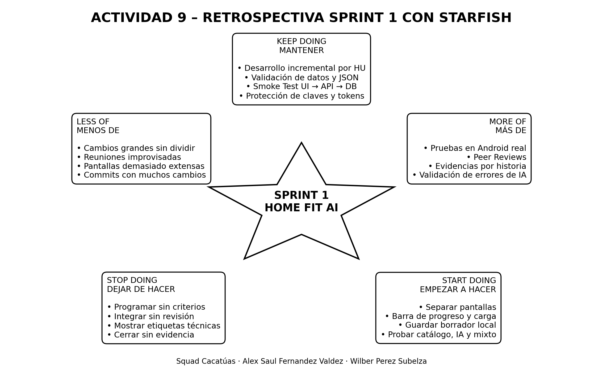

# Actividad 9: Retrospectiva Sprint 1 – “Evolución del Squad con Starfish”

## 1. Identificación

| Elemento | Información |
|---|---|
| Proyecto | **Home Fit AI – Personal Home Exercises With AI** |
| Tipo de sistema | Sistema de apoyo a decisiones para generar rutinas personalizadas de ejercicios en casa |
| Squad | **Cacatúas** |
| Integrantes | **Alex Saul Fernandez Valdez** y **Wilber Perez Subelza** |
| Sprint evaluado | **Sprint 1** |
| Sprint de aplicación de mejoras | **Sprint 2** |
| Técnica utilizada | **Retrospectiva Starfish** |
| Fecha | **1 de julio de 2026** |

---

## 2. Objetivo de la retrospectiva

Analizar de manera crítica, respetuosa y colaborativa el desempeño del Squad **Cacatúas** durante el Sprint 1 de **Home Fit AI**, identificando prácticas que aportaron valor, bloqueos que redujeron la productividad y oportunidades de mejora para el Sprint 2.

La retrospectiva busca fortalecer:

- La organización del trabajo.
- La calidad del frontend y backend.
- La integración entre Flutter, API y Supabase/PostgreSQL.
- La seguridad en el uso de la API de inteligencia artificial.
- La documentación y las evidencias.
- La comunicación y revisión entre integrantes.
- La experiencia del usuario durante la generación de rutinas.

---

## 3. Preparación y apertura

### 3.1 Directiva Primaria

El Scrum Master inició la sesión leyendo la siguiente Directiva Primaria:

> “Independientemente de lo que descubramos, entendemos y creemos sinceramente que todos hicieron el mejor trabajo posible, considerando lo que sabían en ese momento, sus habilidades, los recursos disponibles y la situación existente”.

Esta directiva permitió desarrollar la retrospectiva sin buscar culpables y concentrándose en los procesos, decisiones y oportunidades de mejora.

### 3.2 Rompehielo: “El Termómetro”

Cada integrante calificó su estado al finalizar el Sprint 1 en una escala de 1 a 5:

| Integrante | Valor | Comentario |
|---|---:|---|
| Alex Saul Fernandez Valdez | 4/5 | Satisfecho con el avance técnico, pero con necesidad de mejorar la organización visual y las pruebas del flujo completo. |
| Wilber Perez Subelza | 4/5 | Motivado por la integración del sistema, aunque se identificó carga de trabajo por documentación y ajustes tardíos. |

**Resultado general:** el equipo terminó motivado y conforme con el progreso, pero reconoció que debía mejorar la división de tareas, la experiencia de usuario y la validación temprana de cambios.

---

## 4. Evidencia del tablero Starfish

La siguiente imagen representa el tablero Starfish elaborado por el Squad:



> Al subir este archivo al repositorio, se debe conservar la carpeta `docs/capturas/` para que la imagen se muestre correctamente en GitHub.

---

## 5. Dinámica Starfish

### 5.1 Keep Doing – Mantener

Prácticas que funcionaron bien y deben conservarse:

- Mantener el desarrollo incremental mediante historias de usuario.
- Mantener la separación entre frontend, backend, base de datos y documentación.
- Mantener la validación de datos antes de solicitar una rutina a la API de IA.
- Mantener el límite de tres generaciones exitosas por usuario cada semana.
- Mantener la persistencia del JSON validado y evitar guardar respuestas crudas.
- Mantener el uso de criterios de aceptación antes de cerrar una tarea.
- Mantener el flujo de ramas `feature/*`, Pull Request y revisión hacia `develop`.
- Mantener la protección de claves, tokens y credenciales.
- Mantener el Smoke Test de integración UI → API → base de datos.
- Mantener la consideración de restricciones físicas específicas declaradas por el usuario.

### 5.2 Less Of – Hacer menos

Actividades que consumieron tiempo o energía y deben reducirse:

- Hacer menos cambios grandes sin dividirlos en tareas pequeñas.
- Reducir reuniones improvisadas sin objetivo o resultado registrado.
- Reducir correcciones visuales realizadas al final del Sprint.
- Reducir pantallas extensas que concentran demasiadas funciones.
- Reducir la exposición de valores técnicos como `bajar_peso` o `tren_inferior`.
- Reducir la dependencia de un catálogo pequeño de ejercicios.
- Reducir los commits demasiado grandes o con varios cambios diferentes.
- Reducir el cierre de tareas sin evidencia visual o técnica.
- Reducir el trabajo directo sobre una misma rama por ambos integrantes.

### 5.3 More Of – Hacer más

Prácticas positivas que deben fortalecerse:

- Realizar más pruebas en un dispositivo Android real.
- Ejecutar más pruebas de integración entre Flutter, API y Supabase.
- Revisar con mayor frecuencia los criterios de aceptación.
- Documentar las decisiones técnicas y de experiencia de usuario.
- Dividir las mejoras por pantalla y por historia de usuario.
- Realizar más Peer Reviews antes de integrar a `develop`.
- Traducir los valores internos a mensajes comprensibles para el usuario.
- Probar escenarios alternativos y errores de la API de IA.
- Registrar capturas de pantalla durante el desarrollo y no solamente al final.
- Validar diferentes modos de selección de ejercicios.

### 5.4 Stop Doing – Dejar de hacer

Hábitos que deben eliminarse:

- Dejar de programar sin consultar los criterios de aceptación.
- Dejar de integrar cambios sin una revisión de otro integrante.
- Dejar de mostrar la rutina completa dentro del formulario de creación.
- Dejar de mantener botones provisionales en pantallas finales.
- Dejar de exponer etiquetas internas o nombres técnicos al usuario.
- Dejar de cerrar una historia sin actualizar documentación y tablero.
- Dejar de depender únicamente del catálogo cuando no contiene ejercicios suficientes.
- Dejar de mezclar captura de datos, carga y visualización final en una sola pantalla.
- Dejar de realizar cambios visuales grandes sin evidencia de navegación.

### 5.5 Start Doing – Empezar a hacer

Nuevas prácticas propuestas para el Sprint 2:

- Empezar a separar las pantallas de Crear Rutina, Rutina, Catálogo, Historial y Perfil.
- Empezar a utilizar una barra de progreso dinámica en el formulario.
- Empezar a mostrar una pantalla de carga durante la generación.
- Empezar a guardar localmente el borrador del formulario y la última rutina.
- Empezar a probar tres modos de generación: catálogo, libre con IA y mixto.
- Empezar a crear una tarea de mejora continua dentro del Sprint Backlog.
- Empezar a registrar evidencia visual por cada historia relevante.
- Empezar a revisar los Pull Requests con una lista de verificación.
- Empezar a traducir los valores internos a lenguaje natural.
- Empezar a realizar una validación funcional completa antes del cierre del Sprint.

---

## 6. Priorización mediante votación

Cada integrante recibió **3 puntos** para distribuir entre las propuestas de mejora.

| Propuesta | Alex | Wilber | Total |
|---|---:|---:|---:|
| Refinar la experiencia de usuario y separar pantallas | 2 | 1 | **3** |
| Implementar y validar modos de generación de ejercicios | 1 | 1 | **2** |
| Mejorar capturas, pruebas móviles y evidencias | 0 | 1 | **1** |
| **Total de puntos utilizados** | **3** | **3** | **6** |

### Mejoras seleccionadas

1. **Refinamiento de la experiencia de usuario y separación de pantallas.**
2. **Implementación y validación de los modos de generación de ejercicios.**

---

## 7. Informe de decisiones tomadas

| ¿Qué vamos a mejorar? | Acción SMART | ¿Cómo sabremos que funcionó al final del Sprint 2? | Guardián |
|---|---|---|---|
| Experiencia de usuario y separación de pantallas | Antes de finalizar el Sprint 2, dividir el flujo posterior al inicio de sesión en las pantallas **Crear Rutina**, **Rutina**, **Catálogo**, **Historial** y **Perfil**. Incorporar una barra de progreso, una pantalla de carga y persistencia local del borrador, manteniendo intacto el flujo UI → API → DB. | El usuario puede navegar entre las cinco pantallas; Crear Rutina no muestra el plan completo; Rutina presenta el resultado generado; el formulario recupera el borrador local; no existen botones provisionales; `flutter analyze` y `flutter test` terminan sin errores críticos. | **Alex Saul Fernandez Valdez – Guardián Frontend/UX** |
| Flexibilidad y calidad de la generación de ejercicios | Antes de finalizar el Sprint 2, implementar y probar la HU13 con tres modos: `catalog_only`, `free_ai` y `mixed`. Registrar el modo elegido, validar el JSON, aplicar las restricciones físicas y documentar pruebas de los tres escenarios. | Los tres modos pueden seleccionarse; el backend recibe y registra el modo; el modo mixto puede complementar el catálogo; las restricciones se consideran; la respuesta cumple el esquema JSON; las pruebas principales y alternativas están documentadas. | **Wilber Perez Subelza – Guardián Backend/IA y Calidad** |

---

## 8. Plan de acción para Sprint 2

### Acción 1: Refinamiento de UX

**Objetivo específico:** reorganizar la navegación para que el usuario complete el proceso de generación de rutina de forma clara, progresiva y comprensible.

**Actividades:**

- Separar el formulario de creación y la visualización de la rutina.
- Crear navegación para Rutina, Catálogo, Historial y Perfil.
- Incorporar barra de progreso.
- Incorporar pantalla de carga.
- Eliminar botones provisionales.
- Traducir etiquetas técnicas.
- Guardar el borrador del formulario y la última rutina como caché local.
- Ejecutar pruebas en emulador y dispositivo real.
- Adjuntar capturas de las pantallas finales.

### Acción 2: Modos de generación HU13

**Objetivo específico:** reducir la dependencia del catálogo y aumentar la flexibilidad de las rutinas generadas sin perder control ni trazabilidad.

**Actividades:**

- Incorporar el campo de modo de generación.
- Implementar `catalog_only`.
- Implementar `free_ai`.
- Implementar `mixed`.
- Validar el modo recibido en el backend.
- Registrar el modo en la consulta.
- Aplicar restricciones físicas en los tres modos.
- Validar el JSON devuelto.
- Probar respuestas correctas, incompletas y fallidas.
- Documentar evidencias técnicas y visuales.

---

## 9. Scrumming the Scrum

La mejora debe registrarse como una tarea obligatoria dentro del Sprint Backlog del Sprint 2.

### Tarjeta propuesta para GitHub Projects

**Título:**

```text
Mejora Sprint 2: Refinar UX y ampliar modos de generación
```

**Descripción:**

```text
Aplicar las dos acciones priorizadas en la Retrospectiva Sprint 1:
1. Separar y refinar las pantallas principales del flujo post-login.
2. Implementar y validar los modos catalog_only, free_ai y mixed.

La tarea debe incluir pruebas, evidencias, documentación y revisión mediante Pull Request.
```

**Prioridad:** Alta  
**Estado inicial:** Todo / Pendiente  
**Sprint:** Sprint 2  
**Responsables:** Alex Saul Fernandez Valdez y Wilber Perez Subelza  
**Guardianes:** Alex (Frontend/UX) y Wilber (Backend/IA y Calidad)

### Checklist de la tarjeta

- [ ] Publicar la retrospectiva Sprint 1 en README o Wiki.
- [ ] Adjuntar el tablero Starfish.
- [ ] Crear ramas de trabajo desde `develop`.
- [ ] Separar Crear Rutina y Rutina.
- [ ] Crear navegación para Catálogo, Historial y Perfil.
- [ ] Incorporar barra de progreso y pantalla de carga.
- [ ] Implementar persistencia local del borrador y última rutina.
- [ ] Implementar `catalog_only`.
- [ ] Implementar `free_ai`.
- [ ] Implementar `mixed`.
- [ ] Validar restricciones físicas y JSON.
- [ ] Ejecutar `flutter analyze`.
- [ ] Ejecutar `flutter test`.
- [ ] Ejecutar pruebas backend.
- [ ] Adjuntar capturas de pantalla.
- [ ] Abrir Pull Request hacia `develop`.
- [ ] Realizar Peer Review.
- [ ] Actualizar el tablero de GitHub Projects.

### Enlaces

- **Tablero GitHub Projects del Squad:**  
  https://github.com/users/wilylobo1244/projects/1

- **Enlace directo a la tarjeta de mejora:**  
  `PEGAR_AQUÍ_EL_ENLACE_DE_LA_TARJETA_CREADA`

> GitHub genera el enlace directo después de crear la tarjeta o Issue. Este campo debe reemplazarse antes de la entrega final.

---

## 10. Criterios de verificación al finalizar Sprint 2

La retrospectiva tendrá un resultado positivo si se cumplen los siguientes indicadores:

- Las dos acciones SMART están registradas en el Sprint Backlog.
- Cada acción tiene un guardián responsable.
- Las cinco pantallas principales están separadas y navegables.
- El formulario conserva el borrador local.
- La rutina completa se muestra en una pantalla específica.
- Los tres modos de generación funcionan.
- Las restricciones físicas son tomadas en cuenta.
- El JSON generado es validado antes de persistirse.
- Flutter no accede directamente a Gemini ni a la base de datos.
- No se exponen claves, tokens, prompts completos ni respuestas crudas.
- Las pruebas frontend y backend están registradas.
- Existe evidencia visual del resultado.
- La documentación y el tablero fueron actualizados.

---

## 11. Conclusión

La retrospectiva del Sprint 1 permitió al Squad **Cacatúas** reconocer que el proyecto **Home Fit AI** alcanzó una base técnica importante: autenticación, registro de datos, restricciones específicas, integración UI → API → base de datos, generación mediante IA, validación del JSON y control de uso semanal.

Sin embargo, el equipo identificó que la calidad técnica debe estar acompañada de una experiencia de usuario clara, pruebas frecuentes, documentación continua y una mejor división del trabajo. Las acciones seleccionadas para el Sprint 2 se enfocan en mejorar la navegación y ampliar de forma controlada los modos de generación de ejercicios.

Con estas decisiones, el Squad no solamente mejora el producto, sino también su forma de colaborar, revisar, documentar y aprender en cada ciclo de desarrollo.

---

## 12. Evidencias que deben quedar en GitHub

- [x] Informe de retrospectiva en Markdown.
- [x] Imagen del tablero Starfish.
- [x] Tabla de votación.
- [x] Dos acciones SMART.
- [x] Guardianes asignados.
- [x] Descripción y checklist de la tarea de mejora.
- [ ] Enlace directo a la tarjeta creada en GitHub Projects.
- [ ] Captura del tablero GitHub Projects mostrando la tarea dentro del Sprint 2.
