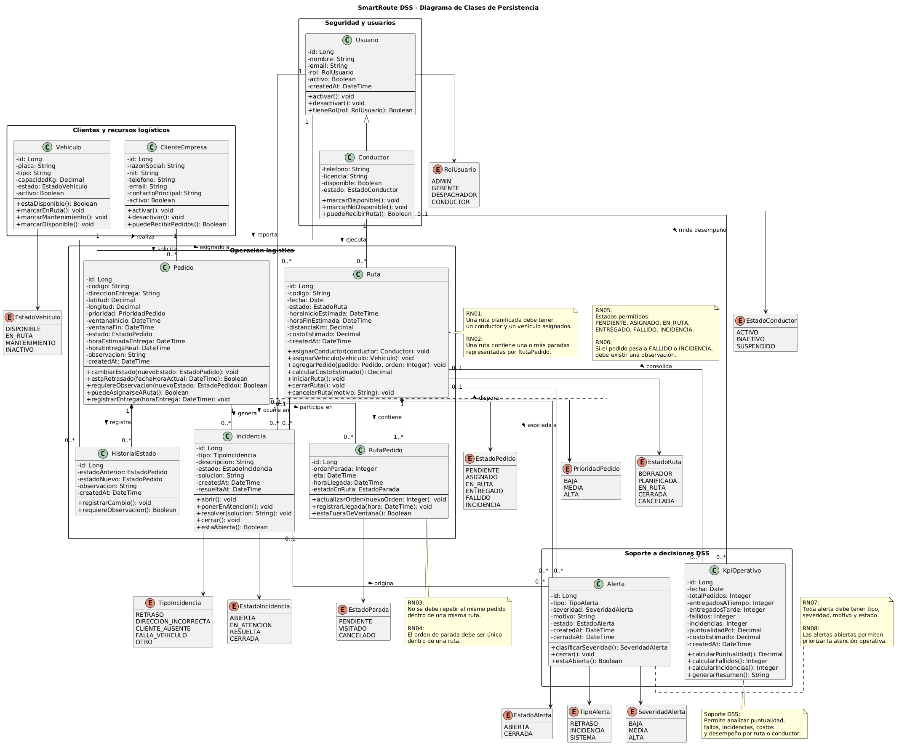

# Actividad Práctica 5: Arquitectura de Persistencia

## "El Cimiento de los Datos"

**Materia:** Sistemas de Información II  
**Proyecto:** SmartRoute DSS  
**Caso:** FlashLogistics - El Caos de la Distribución  
**Squad:** Cacatúas  
**Integrantes:** Alex Saul Fernández Valdez; Wilber Perez Subelza  
**Repositorio GitHub:** https://github.com/wilylobo1244/ACTIVIDAD-2-SDI2/tree/main/ACTIVIDAD_5  
**GitHub Project / Kanban:** https://github.com/users/wilylobo1244/projects/1  
**Fecha:** 16 de junio de 2026

---

## 1. Introducción

La Actividad Práctica 5 tiene como objetivo diseñar la arquitectura de persistencia de **SmartRoute DSS**, el sistema de soporte a la decisión propuesto para resolver el caso FlashLogistics.

Un DSS no solo debe registrar datos; debe estructurarlos de forma íntegra, relacional y útil para la analítica operativa. En el caso de FlashLogistics, los datos deben permitir responder preguntas críticas como:

- ¿Qué pedidos están retrasados?
- ¿Qué rutas presentan más incidencias?
- ¿Qué conductor tiene mayor porcentaje de entregas puntuales?
- ¿Qué pedidos requieren atención urgente?
- ¿Qué alertas abiertas debe priorizar el despacho?
- ¿Qué rutas generan más fallos o retrasos?

Por ello, esta actividad transforma el refinamiento de historias de usuario y los modelos UML anteriores en una propuesta de persistencia robusta.

---

## 2. Enlaces solicitados

| Elemento                | Enlace                                                          |
| ----------------------- | --------------------------------------------------------------- |
| Repositorio GitHub      |https://github.com/wilylobo1244/ACTIVIDAD-2-SDI2/tree/main/ACTIVIDAD_5    |
| GitHub Project / Kanban | https://github.com/users/wilylobo1244/projects/1  |
| Carpeta de modelos      | `capturas/`                                                     |
| Script SQL inicial      | `database/script-SQL.sql`                                       |

---

## 3. Base de diseño tomada de la Actividad 4

La arquitectura de persistencia parte de las historias críticas refinadas en la Actividad 4:

| ID   | Historia crítica                             | Entidades principales derivadas                                |
| ---- | -------------------------------------------- | -------------------------------------------------------------- |
| HU03 | Asignar pedidos a ruta, conductor y vehículo | `pedidos`, `rutas`, `ruta_pedidos`, `conductores`, `vehiculos` |
| HU05 | Actualizar estado de cada pedido             | `pedidos`, `historial_estados`, `incidencias`, `usuarios`      |
| HU08 | Recibir alertas de retrasos e incidencias    | `alertas`, `incidencias`, `rutas`, `pedidos`, `kpi_operativos` |

Estas historias representan el núcleo operativo y analítico del sistema. Por esa razón, el modelo de datos se diseñó para soportar planificación, trazabilidad, alertas y análisis de indicadores.

---

## 4. Diagrama de Clases UML de Persistencia

El diagrama de clases de persistencia modela las entidades principales de SmartRoute DSS, incluyendo atributos, métodos de negocio, relaciones y multiplicidades.

### Diagrama de clases



---

## 5. Entidades persistentes principales

| Clase             | Responsabilidad                                                   |
| ----------------- | ----------------------------------------------------------------- |
| `Usuario`         | Representa a los usuarios autenticados del sistema y sus roles.   |
| `Conductor`       | Representa al usuario operativo encargado de ejecutar rutas.      |
| `ClienteEmpresa`  | Representa a las empresas clientes que reciben pedidos.           |
| `Vehiculo`        | Representa los vehículos usados para ejecutar rutas.              |
| `Pedido`          | Representa una entrega solicitada por un cliente.                 |
| `Ruta`            | Agrupa pedidos y define conductor, vehículo y planificación.      |
| `RutaPedido`      | Entidad intermedia que ordena pedidos dentro de una ruta.         |
| `HistorialEstado` | Registra cada cambio de estado de un pedido.                      |
| `Incidencia`      | Registra problemas ocurridos durante la ejecución de una entrega. |
| `Alerta`          | Representa señales operativas para la toma de decisiones.         |
| `KpiOperativo`    | Guarda métricas consolidadas para análisis DSS.                   |

---

## 6. Explicación de relaciones UML

### 6.1 Herencia

Se utiliza herencia entre `Usuario` y `Conductor` porque un conductor es un usuario del sistema con información adicional para la operación logística.

```txt
Usuario <|-- Conductor
```

Esto permite mantener datos comunes en `Usuario`, como nombre, email, rol y estado, mientras que `Conductor` agrega datos específicos como licencia, teléfono y disponibilidad.

---

### 6.2 Asociación

Se utiliza asociación entre `ClienteEmpresa` y `Pedido`.

```txt
ClienteEmpresa "1" -- "0..*" Pedido
```

Una empresa cliente puede tener muchos pedidos, pero cada pedido pertenece a una sola empresa cliente.

---

### 6.3 Composición

Se utiliza composición entre `Ruta` y `RutaPedido`.

```txt
Ruta "1" *-- "1..*" RutaPedido
```

La composición se justifica porque los registros de `RutaPedido` no tienen sentido sin una ruta. Si una ruta se elimina o se cancela definitivamente, sus paradas asociadas pierden su contexto operativo.

---

### 6.4 Asociación entre ruta y recursos

Una ruta debe tener un conductor y un vehículo asignado.

```txt
Conductor "1" -- "0..*" Ruta
Vehiculo "1" -- "0..*" Ruta
```

Un conductor puede participar en muchas rutas a lo largo del tiempo, pero una ruta planificada tiene un conductor responsable. Lo mismo aplica para vehículos.

---

### 6.5 Composición entre pedido e historial de estado

```txt
Pedido "1" *-- "0..*" HistorialEstado
```

El historial de estado pertenece al pedido. Cada cambio de estado existe para explicar la evolución de ese pedido.

---

### 6.6 Asociación entre pedido, incidencia y alerta

```txt
Pedido "1" -- "0..*" Incidencia
Pedido "1" -- "0..*" Alerta
Incidencia "0..1" -- "0..*" Alerta
```

Un pedido puede tener incidencias y alertas. Una incidencia puede generar una o más alertas operativas para el dashboard.

---

## 7. Reglas de negocio aplicadas

| Nº   | Regla de negocio                                                             | Implementación en persistencia                                   |
| ---- | ---------------------------------------------------------------------------- | ---------------------------------------------------------------- |
| RN01 | Un pedido no puede duplicarse dentro de una misma ruta.                      | `UNIQUE(ruta_id, pedido_id)` en `ruta_pedidos`.                  |
| RN02 | Una ruta debe tener conductor y vehículo.                                    | FK obligatorias en `rutas`.                                      |
| RN03 | Un conductor inactivo no debe recibir rutas nuevas.                          | Validación por `estado` y `disponible`.                          |
| RN04 | Un vehículo en mantenimiento no debe asignarse a rutas.                      | Campo `estado` con restricción `CHECK`.                          |
| RN05 | Todo cambio de estado debe quedar auditado.                                  | Tabla `historial_estados`.                                       |
| RN06 | Si un pedido entra en estado Fallido o Incidencia, debe existir observación. | Restricción y validación en `historial_estados` / `incidencias`. |
| RN07 | Las alertas deben tener severidad.                                           | Campo `severidad` con `CHECK`.                                   |
| RN08 | Las métricas deben permitir análisis por fecha, ruta y conductor.            | Tabla `kpi_operativos`.                                          |

---

## 8. Modelo Relacional

El modelo relacional transforma las clases persistentes en tablas normalizadas con claves primarias, claves foráneas, dominios y restricciones.

### Archivo del modelo relacional

```txt
modelo-relacional.md
```

### Script SQL inicial

```txt
database/script-SQL.sql
```

---

## 9. Diccionario de datos resumido

| Tabla               | Propósito                                                   |
| ------------------- | ----------------------------------------------------------- |
| `usuarios`          | Usuarios autenticados del sistema.                          |
| `conductores`       | Información operativa de conductores.                       |
| `clientes_empresas` | Empresas clientes de FlashLogistics.                        |
| `vehiculos`         | Vehículos utilizados en la operación.                       |
| `pedidos`           | Pedidos o entregas solicitadas por clientes.                |
| `rutas`             | Rutas planificadas para despacho.                           |
| `ruta_pedidos`      | Relación ordenada entre rutas y pedidos.                    |
| `historial_estados` | Auditoría de cambios de estado de pedidos.                  |
| `incidencias`       | Problemas registrados durante la operación.                 |
| `alertas`           | Alertas DSS para atención operativa.                        |
| `kpi_operativos`    | Métricas consolidadas para análisis y soporte a decisiones. |

---

## 10. Validación de soporte a decisiones

El diseño propuesto facilita la toma de decisiones porque estructura los datos operativos de forma relacional y analítica.

### 10.1 Decisiones sobre retrasos

La relación entre `pedidos`, `rutas`, `ruta_pedidos`, `historial_estados` y `alertas` permite identificar pedidos retrasados, pedidos con incidencias y rutas que requieren atención inmediata.

### 10.2 Decisiones sobre eficiencia de rutas

La tabla `rutas`, junto con `ruta_pedidos` y `kpi_operativos`, permite analizar cuántos pedidos fueron entregados, cuántos fallaron y cuál fue el porcentaje de puntualidad.

### 10.3 Decisiones sobre desempeño de conductores

La relación entre `conductores`, `rutas`, `pedidos` e `historial_estados` permite medir desempeño por conductor, cantidad de pedidos atendidos, incidencias generadas y entregas puntuales.

### 10.4 Decisiones sobre atención al cliente

La relación entre `clientes_empresas` y `pedidos` permite identificar clientes con mayor cantidad de retrasos, incidencias o entregas fallidas.

### 10.5 Decisiones basadas en alertas

La tabla `alertas` permite al despachador priorizar atención según severidad, tipo de alerta y estado. Esto transforma datos operativos en señales concretas para actuar.

---

## 11. Normalización aplicada

El modelo se encuentra orientado a tercera forma normal de manera práctica:

| Principio                          | Aplicación                                                                      |
| ---------------------------------- | ------------------------------------------------------------------------------- |
| Evitar duplicidad                  | Conductores, vehículos, clientes y pedidos se almacenan en tablas separadas.    |
| Separar relaciones muchos a muchos | `ruta_pedidos` separa la relación entre rutas y pedidos.                        |
| Mantener trazabilidad              | `historial_estados` evita sobrescribir cambios importantes.                     |
| Soportar analítica                 | `kpi_operativos` permite consolidar métricas sin alterar datos transaccionales. |
| Mantener integridad                | Las FK conectan pedidos, rutas, usuarios, conductores y vehículos.              |

---

## 12. Evidencia de GitHub

Para cumplir con la consigna, se deben subir al repositorio:

| Archivo                    | Ubicación sugerida                          |
| -------------------------- | ------------------------------------------- |
| Diagrama de clases `.png`  | `capturas/diagrama-clases-persistencia.png` |
| Modelo relacional `.md`    | `modelo-relacional.md`                      |
| Diccionario de datos `.md` | `modelo-persistencia-diccionario.md`        |
| Script SQL inicial         | `database/script-SQL.sql`                   |

---

## 14. Conclusión

La arquitectura de persistencia propuesta para SmartRoute DSS estructura los datos centrales de FlashLogistics: pedidos, rutas, conductores, vehículos, estados, incidencias, alertas y KPIs. Este diseño no se limita a un CRUD genérico; está alineado con el problema operativo del caso y permite generar información útil para la toma de decisiones.

Al aplicar relaciones, multiplicidades, restricciones, claves primarias y foráneas, el sistema puede garantizar integridad referencial y trazabilidad. Esto permite que el DSS sea confiable, escalable y preparado para futuras mejoras analíticas.
