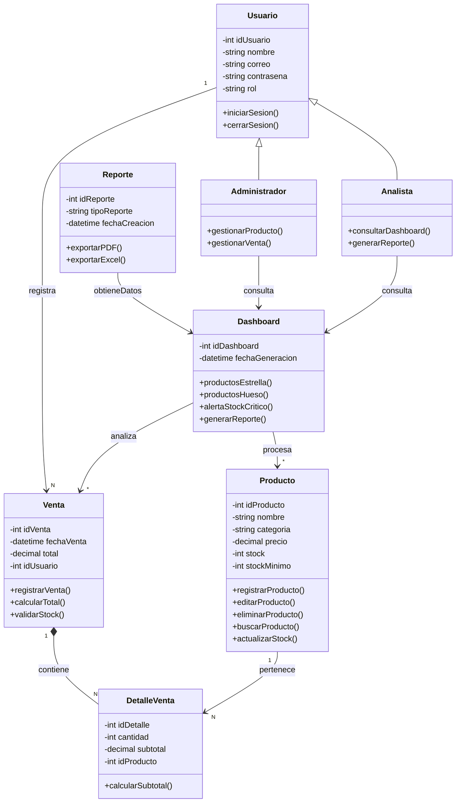

# 3. MODELADO ESTRUCTURAL (CRITERIO 40%)

## 3.1 Diagrama de Clases UML (Mermaid)

- Herencia: `Administrador` y `Analista` extienden `Usuario`.
- Composición: `Venta` contiene `DetalleVenta`.
- Relaciones: el dashboard consume datos de ventas y productos para análisis.
