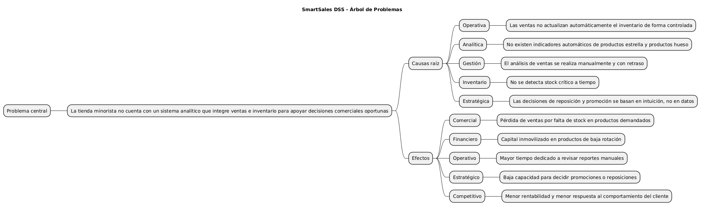
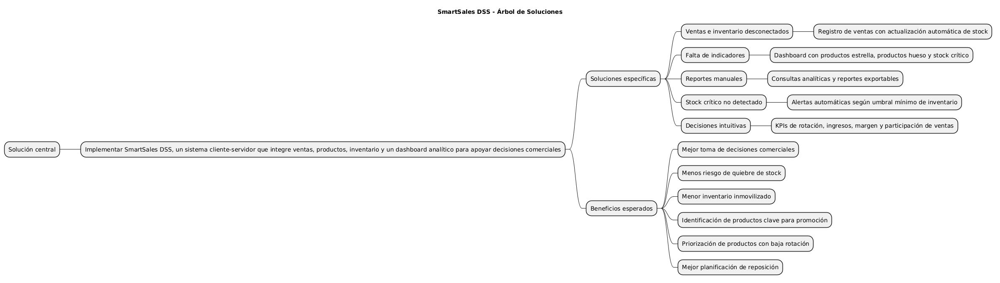
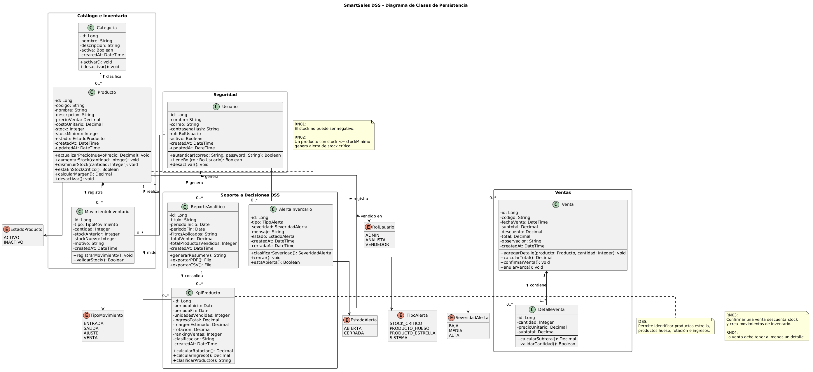
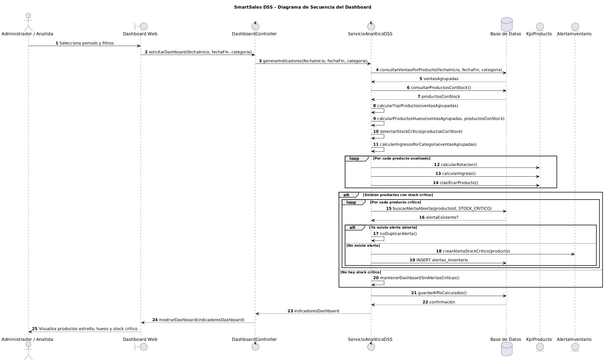
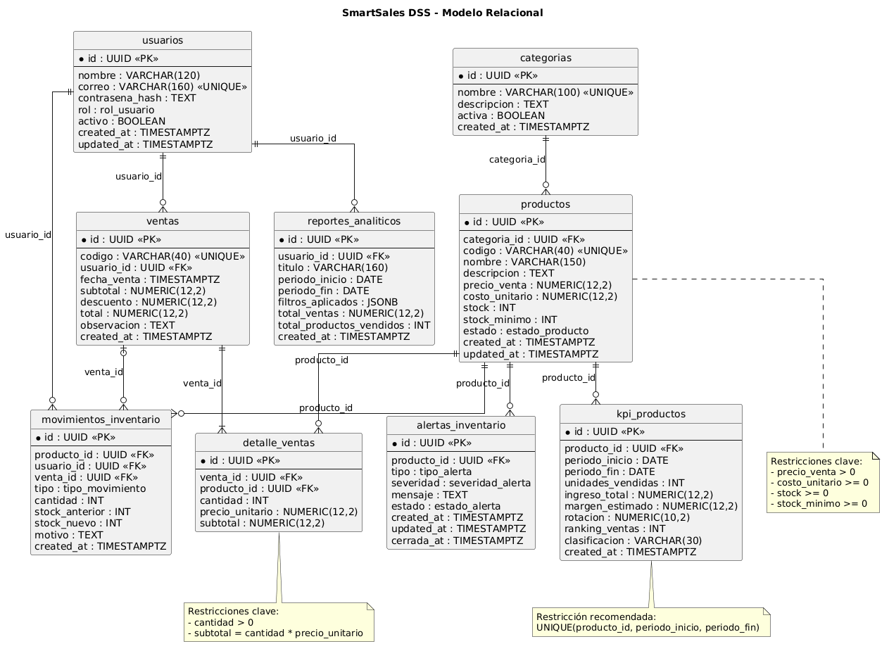
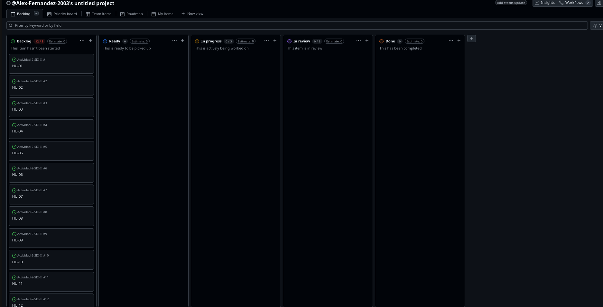

# Actividad 6: Pivot & Plan - Arquitectura Ágil desde Cero

## Proyecto: SmartSales DSS

**Sistema de Apoyo a la Decisión para Ventas Minoristas**  
**Squad:** Cacatúas  
**Integrantes:** Alex Saul Fernández Valdez; Wilber Perez Subelza  
**Repositorio GitHub:**  https://github.com/wilylobo1244/ACTIVIDAD-2-SDI2/tree/main/ACTIVIDAD_6
**GitHub Project / Kanban:** https://github.com/wilylobo1244/ACTIVIDAD-2-SDI2/

---

## 1. Contexto Estratégico

SmartSales DSS surge como respuesta a un problema común en tiendas minoristas: los datos de ventas e inventario existen, pero no se convierten en información útil para decidir. Esto provoca decisiones reactivas, quiebres de stock, exceso de inventario en productos de baja rotación y dificultad para identificar productos rentables.

El objetivo del proyecto no es crear solo un CRUD, sino diseñar un **Sistema de Soporte a la Decisión (DSS)** que permita analizar productos estrella, productos hueso, stock crítico y ventas por periodo.

### Árbol de problemas



### Árbol de soluciones



### Objetivo SMART

Diseñar y dejar listo para programación, en un plazo de 7 días, un MVP cliente-servidor llamado **SmartSales DSS** que permita gestionar productos, registrar ventas, actualizar inventario y visualizar un dashboard analítico con productos estrella, productos hueso y stock crítico.

---

## 2. Definición del MVP

### Es / No es / Hace / No hace

| ES                                         | NO ES                                  |
| ------------------------------------------ | -------------------------------------- |
| Un DSS para ventas minoristas.             | Un ERP financiero completo.            |
| Una aplicación cliente-servidor.           | Un marketplace multi-vendedor.         |
| Un sistema con CRUD de productos y ventas. | Un sistema de facturación electrónica. |
| Un dashboard para análisis comercial.      | Un sistema contable o tributario.      |

| HACE                                   | NO HACE                                       |
| -------------------------------------- | --------------------------------------------- |
| Registra productos.                    | No automatiza compras a proveedores.          |
| Registra ventas y actualiza stock.     | No gestiona nómina.                           |
| Identifica productos estrella y hueso. | No predice demanda con IA avanzada en el MVP. |
| Genera alertas de stock crítico.       | No integra pasarelas de pago.                 |

### Canvas MVP

| Bloque                  | Descripción                                                                                    |
| ----------------------- | ---------------------------------------------------------------------------------------------- |
| Propuesta del MVP       | Centralizar productos, ventas e inventario para generar indicadores comerciales.               |
| Personas atendidas      | Dueño de tienda, administrador y analista de ventas.                                           |
| Funcionalidades mínimas | CRUD de productos, ventas, actualización de stock, dashboard, alertas y reportes.              |
| Métricas                | Top 5 productos estrella, productos hueso, stock crítico, ventas por periodo.                  |
| Hipótesis               | Si la tienda visualiza indicadores clave, tomará mejores decisiones de reposición y promoción. |

---

## 3. Diseño Técnico UML

### Diagrama de Clases de Persistencia



El modelo de clases define las entidades persistentes principales: `Usuario`, `Categoria`, `Producto`, `Venta`, `DetalleVenta`, `MovimientoInventario`, `AlertaInventario`, `KpiProducto` y `ReporteAnalitico`.

### Diagrama de Secuencia de la lógica de decisión



El diagrama de secuencia modela el flujo de generación del dashboard: selección de filtros, consulta de datos, cálculo de productos estrella, productos hueso, stock crítico, generación de alertas y visualización final.

---

## 4. Arquitectura de Datos

### Modelo Relacional



El modelo relacional está orientado a PostgreSQL/Supabase y define tablas normalizadas con claves primarias, foráneas, restricciones e índices.

### Diccionario de datos

El diccionario de datos se encuentra desarrollado en:

```txt
arquitectura-datos.md
```

### Script SQL inicial

```txt
database/init_smartsales.sql
```

---

## 5. Plan de Ejecución

### Product Backlog

El Product Backlog se encuentra en:

```txt
product-backlog.md
```

### GitHub Projects



### Definition of Ready

La DoR se encuentra en:

```txt
definition-of-ready.md
```

---

## 6. Validación Ready to Sprint

SmartSales DSS queda listo para iniciar codificación porque:

- El problema y la solución están definidos.
- El MVP está acotado a 7 días.
- El diseño UML está preparado para generar imágenes.
- El modelo de datos está alineado con el dashboard.
- El SQL inicial es compatible con Supabase.
- El backlog está priorizado.
- La DoR define condiciones claras para iniciar el Sprint.

---

## 7. Conclusión

La Actividad 6 consolida lo aprendido en actividades anteriores y lo aplica en un nuevo escenario de complejidad media. SmartSales DSS no se limita a registrar productos y ventas; convierte los datos operativos en información útil para decidir. Con esta planificación, el squad Cacatúas deja el proyecto en estado **Ready to Sprint**.

---

# 2. Contexto Estratégico

## 2.1 Resumen del problema

Una tienda minorista gestiona sus ventas e inventario de forma principalmente manual o con herramientas dispersas. Aunque registra productos y ventas, no cuenta con un sistema que transforme esos datos en información útil para tomar decisiones.

El problema no es únicamente la falta de un CRUD, sino la ausencia de un **Sistema de Soporte a la Decisión (DSS)** que permita identificar productos estrella, productos de baja rotación, stock crítico y tendencias de venta.

Esto genera decisiones reactivas, compras poco planificadas, exceso de inventario en productos que no rotan y quiebres de stock en productos de alta demanda.

---

## 2.2 Árbol de Problemas

### Problema central

La tienda minorista no cuenta con un sistema analítico que integre ventas e inventario para apoyar decisiones comerciales oportunas.

### Causas raíz

| Tipo        | Causa                                                                        |
| ----------- | ---------------------------------------------------------------------------- |
| Operativa   | Las ventas no actualizan automáticamente el inventario de forma controlada.  |
| Analítica   | No existen indicadores automáticos de productos estrella y productos hueso.  |
| Gestión     | El análisis de ventas se realiza manualmente y con retraso.                  |
| Inventario  | No se detecta stock crítico a tiempo.                                        |
| Estratégica | Las decisiones de reposición y promoción se basan en intuición, no en datos. |

### Efectos

| Tipo        | Efecto                                                              |
| ----------- | ------------------------------------------------------------------- |
| Comercial   | Pérdida de ventas por falta de stock en productos demandados.       |
| Financiero  | Capital inmovilizado en productos de baja rotación.                 |
| Operativo   | Mayor tiempo dedicado a revisar reportes manuales.                  |
| Estratégico | Baja capacidad para decidir promociones o reposiciones.             |
| Competitivo | Menor rentabilidad y menor respuesta al comportamiento del cliente. |

### Imagen


---

## 2.3 Árbol de Soluciones

### Solución central

Implementar **SmartSales DSS**, un sistema cliente-servidor que integre ventas, productos, inventario y un dashboard analítico para apoyar decisiones comerciales.

### Soluciones específicas

| Causa transformada                | Solución propuesta                                                 |
| --------------------------------- | ------------------------------------------------------------------ |
| Ventas e inventario desconectados | Registro de ventas con actualización automática de stock.          |
| Falta de indicadores              | Dashboard con productos estrella, productos hueso y stock crítico. |
| Reportes manuales                 | Consultas analíticas y reportes exportables.                       |
| Stock crítico no detectado        | Alertas automáticas según umbral mínimo de inventario.             |
| Decisiones intuitivas             | KPIs de rotación, ingresos, margen y participación de ventas.      |

### Beneficios esperados

- Mejor toma de decisiones comerciales.
- Menos riesgo de quiebre de stock.
- Menor inventario inmovilizado.
- Identificación de productos clave para promoción.
- Priorización de productos con baja rotación.
- Mejor planificación de reposición.

### Imagen


---

## 2.4 Objetivo SMART

Diseñar y dejar listo para programación, en un plazo de 7 días, un MVP cliente-servidor llamado **SmartSales DSS** que permita gestionar productos, registrar ventas, actualizar inventario y visualizar un dashboard analítico con productos estrella, productos hueso y stock crítico, con el fin de reducir decisiones comerciales reactivas y mejorar la planificación de inventario en una tienda minorista.

| Criterio SMART | Aplicación                                                                                |
| -------------- | ----------------------------------------------------------------------------------------- |
| Específico     | Sistema DSS para ventas minoristas, inventario y dashboard analítico.                     |
| Medible        | Top 5 productos estrella, productos hueso, alertas de stock crítico y ventas por periodo. |
| Alcanzable     | MVP de complejidad media para 7 días de desarrollo.                                       |
| Relevante      | Ataca causas raíz: falta de análisis, inventario descontrolado y decisiones reactivas.    |
| Temporal       | Planificación lista para iniciar codificación el lunes y desarrollar en 7 días.           |

---

## 2.5 Alineación con ODS

| ODS                                            | Relación                                                                              |
| ---------------------------------------------- | ------------------------------------------------------------------------------------- |
| ODS 8: Trabajo decente y crecimiento económico | Mejora la productividad, la rentabilidad y la gestión comercial de pequeños negocios. |
| ODS 9: Industria, innovación e infraestructura | Promueve la digitalización de procesos comerciales mediante un DSS cliente-servidor.  |

---

# 3. Definición del MVP

## 3.1 Visión del producto

Para tiendas minoristas que venden productos físicos y necesitan controlar inventario, **SmartSales DSS** es un Sistema de Soporte a la Decisión que integra productos, ventas e indicadores comerciales en un dashboard analítico.

A diferencia de una hoja de cálculo o un CRUD simple, SmartSales DSS permite identificar productos estrella, productos hueso, stock crítico y tendencias de ventas para mejorar la toma de decisiones.

---

## 3.2 Personas

| Persona            | Rol                                          | Necesidad                                                    | Valor del MVP                                                     |
| ------------------ | -------------------------------------------- | ------------------------------------------------------------ | ----------------------------------------------------------------- |
| Dueño de tienda    | Toma decisiones comerciales y de reposición. | Saber qué productos venden más y cuáles inmovilizan capital. | Dashboard con productos estrella, productos hueso y KPIs.         |
| Administrador      | Gestiona productos, stock y ventas.          | Registrar ventas sin perder control del inventario.          | CRUD de productos y ventas con actualización automática de stock. |
| Analista de ventas | Revisa datos y propone acciones comerciales. | Consultar métricas por periodo y categoría.                  | Reportes y métricas filtrables.                                   |

---

## 3.3 Es / No es / Hace / No hace

| ES                                             | NO ES                                  |
| ---------------------------------------------- | -------------------------------------- |
| Un DSS para ventas minoristas.                 | Un ERP financiero completo.            |
| Una aplicación cliente-servidor.               | Un marketplace multi-vendedor.         |
| Un sistema con CRUD de productos y ventas.     | Un sistema de facturación electrónica. |
| Un dashboard para análisis comercial.          | Un sistema contable o tributario.      |
| Una herramienta para decisiones de inventario. | Una plataforma de pagos online.        |

| HACE                                   | NO HACE                                       |
| -------------------------------------- | --------------------------------------------- |
| Registra productos.                    | No automatiza compras a proveedores.          |
| Registra ventas.                       | No gestiona nómina.                           |
| Actualiza stock automáticamente.       | No realiza contabilidad fiscal.               |
| Identifica productos estrella y hueso. | No predice demanda con IA avanzada en el MVP. |
| Genera alertas de stock crítico.       | No integra pasarelas de pago.                 |
| Permite reportes analíticos básicos.   | No reemplaza un ERP completo.                 |

---

## 3.4 Canvas MVP

| Bloque                  | Descripción                                                                                                                          |
| ----------------------- | ------------------------------------------------------------------------------------------------------------------------------------ |
| Propuesta del MVP       | SmartSales DSS centraliza productos, ventas e inventario para generar indicadores comerciales y alertas de stock.                    |
| Personas atendidas      | Dueño de tienda, administrador y analista de ventas.                                                                                 |
| Viajes atendidos        | Gestión de productos, registro de ventas, análisis de dashboard y consulta de reportes.                                              |
| Funcionalidades mínimas | CRUD de productos, registro de ventas, actualización automática de stock, dashboard, alertas y reportes.                             |
| Resultado esperado      | Mejor control comercial, menor quiebre de stock y decisiones basadas en datos.                                                       |
| Métricas de validación  | Productos estrella, productos hueso, stock crítico, ventas por periodo, ingresos por categoría.                                      |
| Hipótesis principal     | Si la tienda visualiza productos clave, baja rotación y stock crítico, entonces tomará mejores decisiones de reposición y promoción. |
| Costo y cronograma      | Desarrollo de complejidad media en 7 días, con arquitectura cliente-servidor.                                                        |

---

## 3.5 Alcance del MVP

### Incluido

- Gestión de productos.
- Gestión de categorías.
- Registro de ventas.
- Detalle de ventas.
- Actualización automática de stock.
- Dashboard de productos estrella.
- Dashboard de productos hueso.
- Alertas de stock crítico.
- Reportes analíticos básicos.
- Backlog y DoR para iniciar Sprint.

### Fuera del MVP

- Facturación electrónica.
- Gestión de proveedores.
- Compras automáticas.
- Predicción avanzada con IA.
- Pasarela de pagos.
- Multi-sucursal.
- Nómina.
- Contabilidad.

---

# 4. Diseño Técnico UML

## 4.1 Propósito

Esta sección documenta los modelos UML necesarios para dejar SmartSales DSS en estado **Ready to Sprint**.

La consigna solicita:

- Diagrama de Clases UML con atributos, visibilidad, métodos y relaciones.
- Diagrama de Secuencia de la funcionalidad más compleja del dashboard.

En esta base no se incluyen archivos `.puml`. El código PlantUML se deja dentro de este archivo para copiarlo, renderizarlo y exportarlo manualmente como `.png`.

---

## 4.2 Diagrama de Clases de Persistencia

### Imagen


---

## 4.3 Diagrama de Secuencia del Dashboard

### Funcionalidad modelada

La funcionalidad más compleja del dashboard es la generación de indicadores para clasificar productos en:

- Productos estrella.
- Productos hueso.
- Productos con stock crítico.
- Ventas por periodo.
- Ingresos por categoría.

### Imagen


---

## 4.4 Trazabilidad entre UML y MVP

| Funcionalidad MVP      | Clase principal                    | Soporte en secuencia                 |
| ---------------------- | ---------------------------------- | ------------------------------------ |
| CRUD de productos      | `Producto`, `Categoria`            | Se consulta en dashboard y ventas.   |
| Registro de ventas     | `Venta`, `DetalleVenta`            | Alimenta indicadores de productos.   |
| Actualización de stock | `MovimientoInventario`, `Producto` | Permite detectar stock crítico.      |
| Productos estrella     | `KpiProducto`                      | Se calcula desde ventas agrupadas.   |
| Productos hueso        | `KpiProducto`                      | Se calcula por baja rotación.        |
| Alertas de stock       | `AlertaInventario`                 | Se generan si stock <= stock mínimo. |
| Reportes               | `ReporteAnalitico`                 | Consolida KPIs para exportación.     |

---

# 5. Arquitectura de Datos

## 5.1 Objetivo

La arquitectura de datos de SmartSales DSS debe permitir registrar operaciones comerciales y, al mismo tiempo, soportar consultas analíticas para la toma de decisiones.

El modelo relacional está diseñado para responder preguntas como:

- ¿Cuáles son los productos más vendidos?
- ¿Cuáles son los productos de menor rotación?
- ¿Qué productos están en stock crítico?
- ¿Qué categorías generan más ingresos?
- ¿Qué ventas se registraron por periodo?
- ¿Qué alertas siguen abiertas?

---

## 5.2 Modelo Relacional

### Imagen esperada


### Tablas principales

| Tabla                    | Propósito                                                      |
| ------------------------ | -------------------------------------------------------------- |
| `usuarios`               | Usuarios del sistema: administradores, analistas y vendedores. |
| `categorias`             | Clasificación de productos.                                    |
| `productos`              | Catálogo e inventario.                                         |
| `ventas`                 | Cabecera de transacciones de venta.                            |
| `detalle_ventas`         | Productos vendidos en cada venta.                              |
| `movimientos_inventario` | Historial de entradas, salidas, ajustes y ventas.              |
| `alertas_inventario`     | Alertas DSS de stock crítico y eventos relevantes.             |
| `kpi_productos`          | Indicadores por producto y periodo.                            |
| `reportes_analiticos`    | Reportes generados desde el dashboard.                         |

---

## 5.3 Diccionario de datos

## Tabla `usuarios`

| Columna           | Tipo           | Restricciones          | Descripción                 |
| ----------------- | -------------- | ---------------------- | --------------------------- |
| `id`              | `UUID`         | PK                     | Identificador del usuario.  |
| `nombre`          | `VARCHAR(120)` | NOT NULL               | Nombre completo.            |
| `correo`          | `VARCHAR(160)` | NOT NULL, UNIQUE       | Correo de acceso.           |
| `contrasena_hash` | `TEXT`         | NOT NULL               | Contraseña cifrada o hash.  |
| `rol`             | `rol_usuario`  | NOT NULL               | ADMIN, ANALISTA o VENDEDOR. |
| `activo`          | `BOOLEAN`      | NOT NULL, DEFAULT TRUE | Estado lógico.              |
| `created_at`      | `TIMESTAMPTZ`  | NOT NULL               | Fecha de creación.          |
| `updated_at`      | `TIMESTAMPTZ`  | NOT NULL               | Fecha de actualización.     |

---

## Tabla `categorias`

| Columna       | Tipo           | Restricciones          | Descripción          |
| ------------- | -------------- | ---------------------- | -------------------- |
| `id`          | `UUID`         | PK                     | Identificador.       |
| `nombre`      | `VARCHAR(100)` | NOT NULL, UNIQUE       | Nombre de categoría. |
| `descripcion` | `TEXT`         | NULL                   | Descripción.         |
| `activa`      | `BOOLEAN`      | NOT NULL, DEFAULT TRUE | Estado lógico.       |
| `created_at`  | `TIMESTAMPTZ`  | NOT NULL               | Fecha de creación.   |

---

## Tabla `productos`

| Columna          | Tipo              | Restricciones        | Descripción             |
| ---------------- | ----------------- | -------------------- | ----------------------- |
| `id`             | `UUID`            | PK                   | Identificador.          |
| `categoria_id`   | `UUID`            | FK, NOT NULL         | Categoría del producto. |
| `codigo`         | `VARCHAR(40)`     | NOT NULL, UNIQUE     | Código interno.         |
| `nombre`         | `VARCHAR(150)`    | NOT NULL             | Nombre del producto.    |
| `descripcion`    | `TEXT`            | NULL                 | Descripción.            |
| `precio_venta`   | `NUMERIC(12,2)`   | NOT NULL, CHECK > 0  | Precio de venta.        |
| `costo_unitario` | `NUMERIC(12,2)`   | NOT NULL, CHECK >= 0 | Costo.                  |
| `stock`          | `INT`             | NOT NULL, CHECK >= 0 | Stock actual.           |
| `stock_minimo`   | `INT`             | NOT NULL, CHECK >= 0 | Umbral crítico.         |
| `estado`         | `estado_producto` | NOT NULL             | ACTIVO o INACTIVO.      |
| `created_at`     | `TIMESTAMPTZ`     | NOT NULL             | Fecha de creación.      |
| `updated_at`     | `TIMESTAMPTZ`     | NOT NULL             | Fecha de actualización. |

---

## Tabla `ventas`

| Columna       | Tipo            | Restricciones        | Descripción           |
| ------------- | --------------- | -------------------- | --------------------- |
| `id`          | `UUID`          | PK                   | Identificador.        |
| `codigo`      | `VARCHAR(40)`   | NOT NULL, UNIQUE     | Código de venta.      |
| `usuario_id`  | `UUID`          | FK, NOT NULL         | Usuario que registra. |
| `fecha_venta` | `TIMESTAMPTZ`   | NOT NULL             | Fecha de venta.       |
| `subtotal`    | `NUMERIC(12,2)` | NOT NULL, CHECK >= 0 | Subtotal.             |
| `descuento`   | `NUMERIC(12,2)` | NOT NULL, CHECK >= 0 | Descuento.            |
| `total`       | `NUMERIC(12,2)` | NOT NULL, CHECK >= 0 | Total.                |
| `observacion` | `TEXT`          | NULL                 | Observaciones.        |
| `created_at`  | `TIMESTAMPTZ`   | NOT NULL             | Fecha de creación.    |

---

## Tabla `detalle_ventas`

| Columna           | Tipo            | Restricciones        | Descripción                 |
| ----------------- | --------------- | -------------------- | --------------------------- |
| `id`              | `UUID`          | PK                   | Identificador.              |
| `venta_id`        | `UUID`          | FK, NOT NULL         | Venta asociada.             |
| `producto_id`     | `UUID`          | FK, NOT NULL         | Producto vendido.           |
| `cantidad`        | `INT`           | NOT NULL, CHECK > 0  | Cantidad.                   |
| `precio_unitario` | `NUMERIC(12,2)` | NOT NULL, CHECK >= 0 | Precio capturado al vender. |
| `subtotal`        | `NUMERIC(12,2)` | NOT NULL, CHECK >= 0 | Subtotal de línea.          |

---

## Tabla `movimientos_inventario`

| Columna          | Tipo              | Restricciones        | Descripción                      |
| ---------------- | ----------------- | -------------------- | -------------------------------- |
| `id`             | `UUID`            | PK                   | Identificador.                   |
| `producto_id`    | `UUID`            | FK, NOT NULL         | Producto afectado.               |
| `usuario_id`     | `UUID`            | FK, NOT NULL         | Usuario responsable.             |
| `venta_id`       | `UUID`            | FK, NULL             | Venta que originó movimiento.    |
| `tipo`           | `tipo_movimiento` | NOT NULL             | ENTRADA, SALIDA, AJUSTE o VENTA. |
| `cantidad`       | `INT`             | NOT NULL, CHECK > 0  | Cantidad movida.                 |
| `stock_anterior` | `INT`             | NOT NULL, CHECK >= 0 | Stock previo.                    |
| `stock_nuevo`    | `INT`             | NOT NULL, CHECK >= 0 | Stock posterior.                 |
| `motivo`         | `TEXT`            | NULL                 | Motivo del movimiento.           |
| `created_at`     | `TIMESTAMPTZ`     | NOT NULL             | Fecha del movimiento.            |

---

## Tabla `alertas_inventario`

| Columna       | Tipo               | Restricciones | Descripción           |
| ------------- | ------------------ | ------------- | --------------------- |
| `id`          | `UUID`             | PK            | Identificador.        |
| `producto_id` | `UUID`             | FK, NOT NULL  | Producto relacionado. |
| `tipo`        | `tipo_alerta`      | NOT NULL      | Tipo de alerta.       |
| `severidad`   | `severidad_alerta` | NOT NULL      | BAJA, MEDIA o ALTA.   |
| `mensaje`     | `TEXT`             | NOT NULL      | Mensaje de alerta.    |
| `estado`      | `estado_alerta`    | NOT NULL      | ABIERTA o CERRADA.    |
| `created_at`  | `TIMESTAMPTZ`      | NOT NULL      | Fecha de creación.    |
| `cerrada_at`  | `TIMESTAMPTZ`      | NULL          | Fecha de cierre.      |

---

## Tabla `kpi_productos`

| Columna             | Tipo            | Restricciones        | Descripción               |
| ------------------- | --------------- | -------------------- | ------------------------- |
| `id`                | `UUID`          | PK                   | Identificador.            |
| `producto_id`       | `UUID`          | FK, NOT NULL         | Producto analizado.       |
| `periodo_inicio`    | `DATE`          | NOT NULL             | Inicio del periodo.       |
| `periodo_fin`       | `DATE`          | NOT NULL             | Fin del periodo.          |
| `unidades_vendidas` | `INT`           | NOT NULL, CHECK >= 0 | Unidades vendidas.        |
| `ingreso_total`     | `NUMERIC(12,2)` | NOT NULL, CHECK >= 0 | Ingreso generado.         |
| `margen_estimado`   | `NUMERIC(12,2)` | NOT NULL             | Margen estimado.          |
| `rotacion`          | `NUMERIC(10,2)` | NOT NULL, CHECK >= 0 | Indicador de rotación.    |
| `ranking_ventas`    | `INT`           | NULL                 | Ranking del producto.     |
| `clasificacion`     | `VARCHAR(30)`   | NOT NULL             | ESTRELLA, HUESO o NORMAL. |
| `created_at`        | `TIMESTAMPTZ`   | NOT NULL             | Fecha de cálculo.         |

---

## Tabla `reportes_analiticos`

| Columna                    | Tipo            | Restricciones        | Descripción                 |
| -------------------------- | --------------- | -------------------- | --------------------------- |
| `id`                       | `UUID`          | PK                   | Identificador.              |
| `usuario_id`               | `UUID`          | FK, NOT NULL         | Usuario que genera.         |
| `titulo`                   | `VARCHAR(160)`  | NOT NULL             | Título del reporte.         |
| `periodo_inicio`           | `DATE`          | NOT NULL             | Inicio del periodo.         |
| `periodo_fin`              | `DATE`          | NOT NULL             | Fin del periodo.            |
| `filtros_aplicados`        | `JSONB`         | NULL                 | Filtros utilizados.         |
| `total_ventas`             | `NUMERIC(12,2)` | NOT NULL, CHECK >= 0 | Total del periodo.          |
| `total_productos_vendidos` | `INT`           | NOT NULL, CHECK >= 0 | Total de unidades vendidas. |
| `created_at`               | `TIMESTAMPTZ`   | NOT NULL             | Fecha de generación.        |

---

## 5.4 Reglas de negocio en datos

| Regla                                                      | Implementación                                       |
| ---------------------------------------------------------- | ---------------------------------------------------- |
| El stock no puede ser negativo.                            | `CHECK(stock >= 0)` y validación transaccional.      |
| El precio de venta debe ser mayor a cero.                  | `CHECK(precio_venta > 0)`.                           |
| Una venta debe tener al menos un detalle.                  | Regla de aplicación + transacción.                   |
| Cada venta descuenta stock.                                | Trigger sobre `detalle_ventas`.                      |
| Cada descuento de stock genera movimiento.                 | Tabla `movimientos_inventario`.                      |
| Producto en stock crítico genera alerta.                   | Trigger o función `generar_alertas_stock_critico()`. |
| No se duplican alertas abiertas del mismo producto y tipo. | Índice único parcial.                                |
| Los KPIs se calculan por producto y periodo.               | `UNIQUE(producto_id, periodo_inicio, periodo_fin)`.  |

---

## 5.5 Consultas DSS soportadas

| Pregunta de negocio                       | Tablas utilizadas                                         |
| ----------------------------------------- | --------------------------------------------------------- |
| ¿Cuáles son los productos estrella?       | `ventas`, `detalle_ventas`, `productos`, `kpi_productos`. |
| ¿Cuáles son los productos hueso?          | `productos`, `detalle_ventas`, `kpi_productos`.           |
| ¿Qué productos están en stock crítico?    | `productos`, `alertas_inventario`.                        |
| ¿Qué categoría genera más ingresos?       | `categorias`, `productos`, `detalle_ventas`, `ventas`.    |
| ¿Cómo evolucionan las ventas por periodo? | `ventas`, `detalle_ventas`.                               |
| ¿Qué productos requieren reposición?      | `productos`, `alertas_inventario`.                        |

---

# 6. Product Backlog

## 6.1 Objetivo

Este Product Backlog deja SmartSales DSS listo para iniciar un Sprint de 7 días. Las historias están redactadas con formato estándar y criterios de aceptación verificables, siguiendo el criterio INVEST.

---

## 6.2 Épicas

| Código | Épica                            | Descripción                                                         |
| ------ | -------------------------------- | ------------------------------------------------------------------- |
| E01    | Gestión de Catálogo e Inventario | CRUD de categorías, productos y control de stock.                   |
| E02    | Registro de Ventas               | Registro transaccional de ventas y detalle de productos vendidos.   |
| E03    | Dashboard DSS                    | Indicadores de productos estrella, productos hueso y stock crítico. |
| E04    | Reportes y Preparación Ágil      | Exportación de reportes, backlog, DoR y evidencias.                 |

---

## 6.3 Backlog priorizado

| ID   | Épica | Historia de Usuario                                                                                                                | Criterios de Aceptación                                                                                                                                                  | Prioridad | Estimación |
| ---- | ----- | ---------------------------------------------------------------------------------------------------------------------------------- | ------------------------------------------------------------------------------------------------------------------------------------------------------------------------ | --------- | ---------- |
| HU01 | E01   | Como administrador, quiero registrar productos, para mantener actualizado el catálogo de la tienda.                                | 1. Nombre, categoría, precio y stock son obligatorios.<br>2. El precio debe ser mayor a 0.<br>3. El stock inicial no puede ser negativo.                                 | Alta      | 3 pts      |
| HU02 | E01   | Como administrador, quiero editar productos, para corregir información de catálogo e inventario.                                   | 1. Permite actualizar nombre, categoría, precio, costo y stock mínimo.<br>2. No permite precio negativo ni stock negativo.<br>3. Registra fecha de actualización.        | Alta      | 3 pts      |
| HU03 | E01   | Como administrador, quiero desactivar productos, para impedir ventas de artículos que ya no se comercializan sin perder historial. | 1. El producto queda en estado inactivo.<br>2. No aparece disponible para nuevas ventas.<br>3. Sus ventas históricas se conservan.                                       | Media     | 2 pts      |
| HU04 | E02   | Como vendedor, quiero registrar una venta con varios productos, para controlar ingresos y actualizar inventario.                   | 1. Se pueden seleccionar productos activos.<br>2. El sistema valida stock antes de confirmar.<br>3. El total se calcula automáticamente.<br>4. La venta descuenta stock. | Alta      | 5 pts      |
| HU05 | E02   | Como administrador, quiero consultar ventas históricas, para analizar el comportamiento comercial por periodo.                     | 1. Muestra ventas ordenadas por fecha.<br>2. Permite filtrar por rango de fechas.<br>3. Incluye usuario responsable y total.                                             | Media     | 3 pts      |
| HU06 | E03   | Como dueño de tienda, quiero ver productos estrella, para priorizar promociones y reposición.                                      | 1. Muestra Top 5 productos por unidades vendidas.<br>2. Incluye ingresos generados por producto.<br>3. Permite filtrar por periodo.                                      | Alta      | 5 pts      |
| HU07 | E03   | Como dueño de tienda, quiero ver productos hueso, para reducir inventario inmovilizado.                                            | 1. Muestra productos con menor rotación.<br>2. Incluye stock actual e ingresos generados.<br>3. Permite identificar productos candidatos a promoción o liquidación.      | Alta      | 5 pts      |
| HU08 | E03   | Como administrador, quiero recibir alertas de stock crítico, para reabastecer productos antes de perder ventas.                    | 1. Identifica productos con stock menor o igual al mínimo.<br>2. Muestra alertas en el dashboard.<br>3. Evita duplicar alertas abiertas del mismo producto.              | Alta      | 3 pts      |
| HU09 | E04   | Como analista, quiero generar reportes analíticos, para compartir resultados de ventas e inventario.                               | 1. Permite generar reporte por periodo.<br>2. Incluye productos estrella, productos hueso y stock crítico.<br>3. Registra fecha de generación y usuario.                 | Media     | 3 pts      |
| HU10 | E03   | Como dueño de tienda, quiero visualizar ingresos por categoría, para decidir qué líneas de producto fortalecer.                    | 1. Agrupa ingresos por categoría.<br>2. Permite filtrar por periodo.<br>3. Ordena categorías por mayor ingreso.                                                          | Media     | 3 pts      |

---

## 6.4 Revisión INVEST

| Criterio      | Aplicación                                                                      |
| ------------- | ------------------------------------------------------------------------------- |
| Independiente | Cada HU puede implementarse por módulo: catálogo, ventas, dashboard o reportes. |
| Negociable    | Las historias describen valor de negocio, no una solución técnica cerrada.      |
| Valorable     | Cada historia beneficia a administrador, vendedor, analista o dueño.            |
| Estimable     | Todas las historias tienen alcance y estimación.                                |
| Pequeña       | Cada HU puede abordarse dentro de un sprint corto.                              |
| Verificable   | Cada HU tiene criterios de aceptación medibles.                                 |

---

## 6.5 Orden sugerido de ejecución en 7 días

| Día   | Foco                                     | Historias  |
| ----- | ---------------------------------------- | ---------- |
| Día 1 | Base de datos y catálogo                 | HU01, HU02 |
| Día 2 | Productos activos/inactivos e inventario | HU03       |
| Día 3 | Registro de ventas                       | HU04       |
| Día 4 | Historial de ventas                      | HU05       |
| Día 5 | Dashboard productos estrella y hueso     | HU06, HU07 |
| Día 6 | Alertas y categoría                      | HU08, HU10 |
| Día 7 | Reportes, pruebas y cierre               | HU09       |

---

# 7. Definition of Ready

## 7.1 Propósito

La Definition of Ready define el estándar mínimo para que una historia de usuario pueda entrar al Sprint sin ambigüedad.

SmartSales DSS debe quedar en estado **Ready to Sprint**, por lo que cada historia debe tener suficiente claridad funcional, técnica y de negocio.

---

## 7.2 Checklist DoR

| Nº  | Criterio                                                                        | Estado |
| --- | ------------------------------------------------------------------------------- | ------ |
| 1   | La historia está redactada como: Como [rol], quiero [acción], para [beneficio]. | ☐      |
| 2   | La historia pertenece a una épica definida.                                     | ☐      |
| 3   | La historia tiene prioridad.                                                    | ☐      |
| 4   | La historia tiene estimación en Story Points.                                   | ☐      |
| 5   | La historia tiene criterios de aceptación claros y verificables.                | ☐      |
| 6   | La historia cumple INVEST.                                                      | ☐      |
| 7   | Los actores involucrados están identificados.                                   | ☐      |
| 8   | Las tablas o entidades necesarias están identificadas.                          | ☐      |
| 9   | Las reglas de negocio principales están definidas.                              | ☐      |
| 10  | Los flujos alternativos o errores esperados están identificados.                | ☐      |
| 11  | La historia está alineada con el MVP.                                           | ☐      |
| 12  | La historia aporta valor DSS o valor operativo directo.                         | ☐      |
| 13  | El diseño UML relacionado está disponible como imagen.                          | ☐      |
| 14  | El modelo relacional soporta la historia.                                       | ☐      |
| 15  | El Issue en GitHub contiene checklist de criterios de aceptación.               | ☐      |
| 16  | El Issue tiene labels de épica y prioridad.                                     | ☐      |
| 17  | La historia puede completarse dentro del sprint de 7 días.                      | ☐      |
| 18  | No existen bloqueos críticos para iniciar desarrollo.                           | ☐      |

---

## 7.3 Ready to Sprint

El proyecto se considera **Ready to Sprint** cuando:

- El contexto estratégico está documentado.
- El MVP está definido y acotado.
- El diagrama de clases de persistencia está generado como PNG.
- El diagrama de secuencia del dashboard está generado como PNG.
- El modelo relacional y diccionario de datos están completos.
- El script SQL inicial está disponible.
- El Product Backlog está priorizado.
- Las historias tienen criterios de aceptación.
- El tablero Kanban está preparado en GitHub Projects.
- El equipo sabe qué construir durante los 7 días.

---

## 7.4 Labels de GitHub

| Label                         | Uso                        |
| ----------------------------- | -------------------------- |
| `Epic: Catálogo e Inventario` | HU01, HU02, HU03           |
| `Epic: Ventas`                | HU04, HU05                 |
| `Epic: Dashboard DSS`         | HU06, HU07, HU08, HU10     |
| `Epic: Reportes`              | HU09                       |
| `type: user-story`            | Todas las HU               |
| `priority: high`              | Historias críticas         |
| `priority: medium`            | Historias importantes      |
| `mvp`                         | Alcance incluido en el MVP |

---

## 7.5 Columnas del Kanban

| Columna     | Descripción                         |
| ----------- | ----------------------------------- |
| Backlog     | Historias identificadas.            |
| Ready       | Historias que cumplen DoR.          |
| In Progress | Historias en desarrollo.            |
| Review / QA | Historias terminadas y en revisión. |
| Done        | Historias aceptadas.                |
