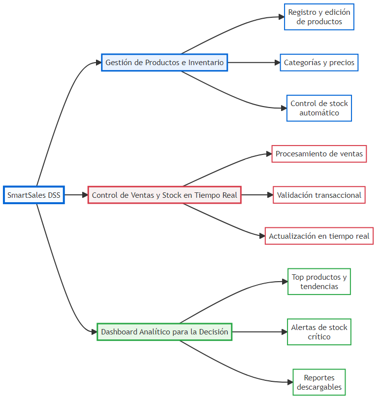
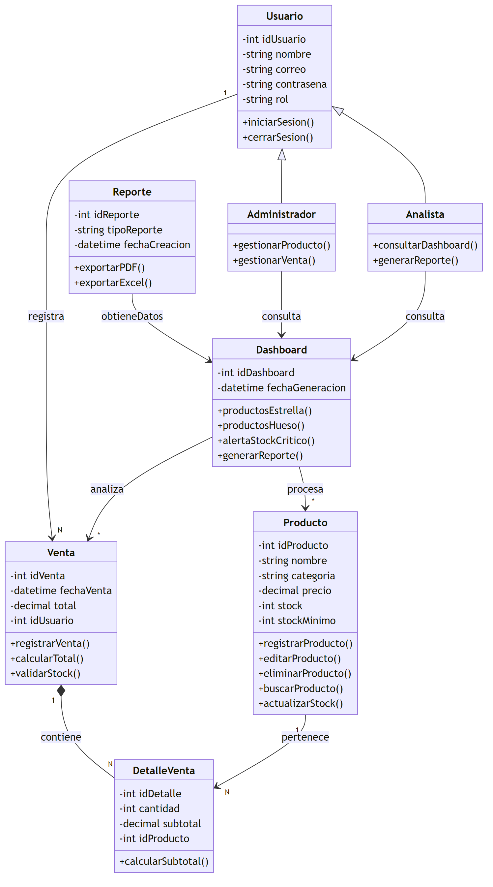
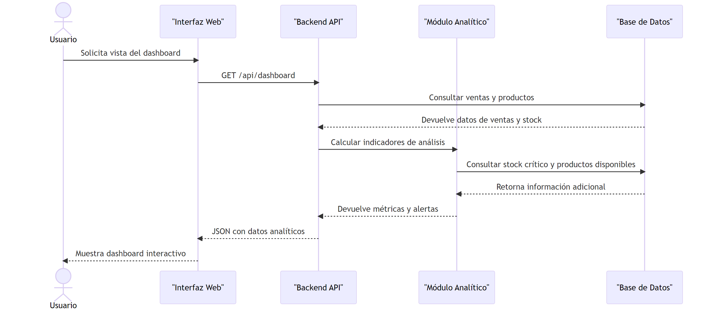
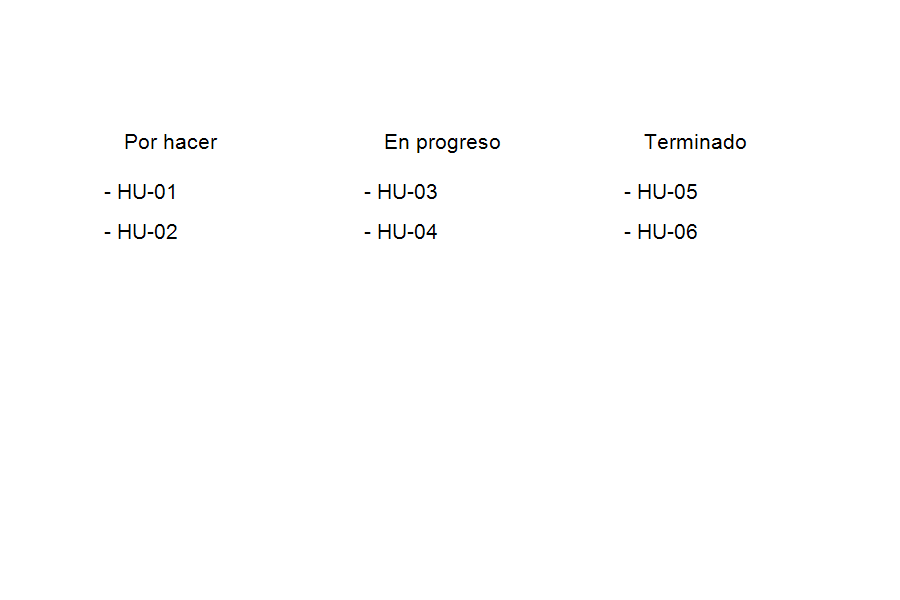

# ACTIVIDAD 6: PIVOT & PLAN – ARQUITECTURA ÁGIL DESDE CERO

# Proyecto: SmartSales DSS

## Sistema de Apoyo a la Decisión para Ventas Minoristas

### Squad: Los Innovadores

### Integrantes

- Wilber Perez Subelza
- Integrante 2

### Repositorio GitHub

https://github.com/wilylobo1244/ACTIVIDAD-2-SDI2

---

# 1. CONTEXTO ESTRATÉGICO

## 1.1 Resumen del problema

La tienda minorista carece de un sistema de ventas e inventario que integre datos operativos con indicadores analíticos. Esto genera decisiones reactivas, exceso de stock en productos lentos y quiebres de inventario en productos de alta demanda.

## 1.2 Árbol de Problemas

### Problema Central

No existe un mecanismo automatizado que convierta datos de ventas e inventario en información decisiva para el negocio.

### Causas raíz

- No hay visibilidad continua de productos estrella y productos de baja rotación.
- Las ventas no actualizan el inventario en tiempo real.
- No existen alertas automáticas de stock crítico.
- El análisis se hace con reportes manuales y desactualizados.

### Efectos

- Inventario inmovilizado en productos de baja rotación.
- Pérdidas de ventas por faltantes de stock.
- Decisiones tácticas sin respaldo de datos.
- Menor rentabilidad y competitividad.

## 1.3 Árbol de Soluciones



### Solución Estratégica

--
Antes de mover una historia a `Ready` crear las tareas técnicas asociadas: endpoints API, migraciones de BD, pruebas unitarias, pruebas de integración, definición de contratos (API spec) y mockups UI. Cada historia en Ready debe tener subtareas técnicas y criterios de prueba.

## 5.2 Definition of Ready (DoR)
| Canal | Aplicación web responsiva con backend API |
| Beneficio | Mejora la toma de decisiones y reduce el riesgo de quiebre de stock |

---

# 3. DISEÑO TÉCNICO

## 3.1 Diagrama de Clases de Persistencia



### Observaciones del UML

- `Usuario` es la clase base que contiene datos de acceso y roles.
- `Producto` mantiene atributos de inventario y métodos de gestión de stock.
- `Venta` modela transacciones con referencia a `Usuario` y calcula totales.
- `DetalleVenta` representa las líneas de venta y guarda subtotales.
- `Dashboard` encapsula la lógica de análisis y genera métricas clave.

### Especificación de clases (atributos, visibilidad y métodos de negocio)

- `Usuario`
  - Atributos: `+id_usuario: int`, `+nombre: string`, `+correo: string`, `-contrasena: string`, `+rol: enum{ADMIN,ANALISTA}`
  - Métodos: `+autenticar(correo, pass): Token`, `+registrarVenta(venta): Venta`
  - Observaciones: la contraseña se guarda hasheada; `correo` único.

- `Producto`
  - Atributos: `+id_producto: int`, `+nombre: string`, `+categoria: string`, `+precio: decimal`, `+stock: int`, `+stock_minimo: int`, `+activo: boolean`
  - Métodos: `+actualizarStock(delta): void`, `+marcarInactivo(): void`
  - Observaciones: `stock` y `stock_minimo` no negativos.

- `Venta`
  - Atributos: `+id_venta: int`, `+fecha_venta: datetime`, `+total: decimal`, `+id_usuario: int`
  - Métodos: `+calcularTotal(): decimal`, `+validarStock(): bool`
  - Observaciones: creación en transacción que incluye `DetalleVenta`.

- `DetalleVenta`
  - Atributos: `+id_detalle: int`, `+id_venta: int`, `+id_producto: int`, `+cantidad: int`, `+subtotal: decimal`
  - Métodos: `+calcularSubtotal(): decimal`
  - Observaciones: relación 1-* con `Venta` y *-1 con `Producto`.

- `Dashboard`
  - Métodos: `+topProductos(n, periodo): List`, `+productosHueso(n, periodo): List`, `+alertasStock(): List`, `+generarReporte(filtros): File`
  - Observaciones: componente analítico que consume agregaciones de `Venta` y `DetalleVenta`.

### Relación entre clases (resumen)
- `Usuario 1 --- * Venta` (un usuario puede registrar muchas ventas).
- `Venta 1 --- * DetalleVenta` (una venta tiene múltiples líneas).
- `DetalleVenta * --- 1 Producto` (cada línea referencia un producto).
- `Dashboard` consulta agregaciones de `Venta` y `Producto` (dependencia, no persistencia).

## 3.2 Diagrama de Secuencia de la lógica de decisión



### Flujo principal del Dashboard

1. El usuario solicita el panel de control desde el frontend.
## 5.1 Product Backlog

Historias definidas con formato INVEST (identificable, negociable, valiosa, estimable, pequeña, testeable). Cada historia incluye criterios de aceptación, prioridad y estimación en puntos.

### HU-01 — Crear producto
- Como: Administrador
- Quiero: crear un producto con `nombre`, `categoria`, `precio`, `stock` y `stock_minimo`.
- Para: disponer de un catálogo actualizado y confiable.
- Criterios de aceptación:
  - Formulario con validaciones: `nombre` (no vacío), `precio` > 0, `stock` >= 0, `stock_minimo` >= 0.
  - Al confirmar se crea registro en `Producto` con `activo = true`.
  - Respuesta API: 201 con el objeto creado y `id_producto`.
  - UI: aparece en la lista y muestra mensaje de éxito.
- Prioridad: Alta — Estimación: 3 pts

### HU-02 — Editar producto
- Como: Administrador
- Quiero: actualizar atributos de un producto existente.
- Para: corregir datos y ajustar niveles de inventario.
- Criterios de aceptación:
  - Validaciones idénticas a HU-01.
  - Auditoría mínima: `modificado_por`, `fecha_modificacion`.
  - Respuesta API: 200 con objeto actualizado.
- Prioridad: Alta — Estimación: 2 pts

### HU-03 — Desactivar producto
- Como: Administrador
- Quiero: marcar `activo = false` sin eliminar el registro.
- Para: impedir nuevas ventas manteniendo historial.
- Criterios de aceptación:
  - Producto no aparece en selectores de venta.
  - No se elimina información histórica.
- Prioridad: Media — Estimación: 1 pt

### HU-04 — Registrar venta (transaccional)
- Como: Cajero/Administrador
- Quiero: registrar venta con líneas (producto + cantidad)
- Para: grabar ingresos y decrementar stock en una transacción segura.
- Criterios de aceptación:
  - Valida stock (si insuficiente, rechaza con 409 Conflict y mensaje claro).
  - Crea `Venta` y `DetalleVenta` en transacción atómica.
  - Disminuye `Producto.stock` y registra `subtotal` por línea.
  - Respuesta API: 201 con `id_venta` y detalle.
  - UI: recibo imprimible/exportable.
- Prioridad: Alta — Estimación: 8 pts

### HU-05 — Historial y filtros de ventas
- Como: Analista/Administrador
- Quiero: consultar ventas por filtros (fecha, producto, usuario)
- Para: generar análisis y auditoría.
- Criterios de aceptación:
  - Soporta paginación, orden y filtros.
  - Exportación a CSV/Excel de resultados filtrados.
- Prioridad: Media — Estimación: 3 pts

### HU-06 — Dashboard: Productos estrella
- Como: Dueño/Analista
- Quiero: ver Top N productos por unidades e ingresos
- Para: decidir promociones y prioridades de compra.
- Criterios de aceptación:
  - Top 5/10 por cantidad y por ingreso.
  - Visualizaciones: barras, porcentajes y tendencia por periodo.
  - Periodo configurable (día/semana/mes/trimestre).
- Prioridad: Alta — Estimación: 5 pts

### HU-07 — Dashboard: Productos hueso
- Como: Analista
- Quiero: identificar productos con baja rotación y alto stock
- Para: ejecutar acciones de reducción de inventario.
- Criterios de aceptación:
  - Lista de productos con ventas bajas en el periodo y su `stock` y `dias_inventario` estimado.
  - Sugerencia de acciones (liquidar, promocionar).
- Prioridad: Media — Estimación: 4 pts

### HU-08 — Alertas de stock crítico y lista de reposición
- Como: Administrador
- Quiero: recibir alertas y generar lista priorizada de reposición
- Para: evitar quiebres de stock en productos críticos.
- Criterios de aceptación:
  - Dashboard muestra alertas (productos con `stock <= stock_minimo`).
  - Genera lista con orden por prioridad y cantidad sugerida (stock_minimo - stock).
  - Permite exportar la lista.
- Prioridad: Alta — Estimación: 3 pts

### HU-09 — Reportes analíticos exportables
- Como: Analista
- Quiero: exportar reportes (PDF/Excel) con métricas del dashboard
- Para: compartir información y documentar decisiones.
- Criterios de aceptación:
  - Selección de métricas y periodo.
  - Generación de PDF/Excel con encabezado, filtros y fecha de creación.
- Prioridad: Media — Estimación: 3 pts

--
Antes de mover una historia a `Ready`, crear tareas técnicas asociadas: endpoints API, migraciones de BD, pruebas unitarias, pruebas de integración, definición de contratos (API spec) y mockups UI.

### HU-06: Ver productos estrella
Como administrador quiero identificar productos estrella para potenciar ventas.

Criterios de aceptación:
- Se muestra el Top 5 de productos con mayores ventas.
- Incluye unidades vendidas e ingresos por producto.
- Muestra participación porcentual en las ventas.

### HU-07: Ver productos hueso
Como administrador quiero identificar productos de baja rotación para reducir inventario inmovilizado.

Criterios de aceptación:
- Se muestra el Top 5 de productos con menor rotación.
- Muestra stock actual y días estimados de inventario.

### HU-08: Alertas de stock crítico
Como administrador quiero recibir alertas de stock crítico para reabastecer a tiempo.

Criterios de aceptación:
- El sistema marca productos con stock <= stock_minimo.
- Muestra alertas en el dashboard.
- Genera lista de reposición con prioridades.

### HU-09: Generar reportes analíticos
Como administrador quiero exportar reportes para compartir resultados.

Criterios de aceptación:
- El dashboard exporta reportes en PDF y Excel.
- Incluye métricas clave y fecha de generación.
- Permite descargar y compartir el reporte.

## 5.1 Modelo Relacional

Se incluye un esquema relacional simplificado y consideraciones de integridad y performance para el diseño de la base de datos.

```sql
CREATE TABLE Usuario(
    id_usuario INT PRIMARY KEY AUTO_INCREMENT,
    nombre VARCHAR(100) NOT NULL,
    correo VARCHAR(100) NOT NULL UNIQUE,
    contrasena VARCHAR(255) NOT NULL,
    rol ENUM('ADMIN','ANALISTA') NOT NULL,
    fecha_creacion DATETIME DEFAULT CURRENT_TIMESTAMP
);

CREATE TABLE Producto(
    id_producto INT PRIMARY KEY AUTO_INCREMENT,
    nombre VARCHAR(150) NOT NULL,
    categoria VARCHAR(100) NOT NULL,
    precio DECIMAL(10,2) NOT NULL CHECK (precio > 0),
    stock INT NOT NULL CHECK (stock >= 0),
    stock_minimo INT NOT NULL DEFAULT 1,
    activo BOOLEAN NOT NULL DEFAULT TRUE,
    fecha_creacion DATETIME DEFAULT CURRENT_TIMESTAMP
);

CREATE TABLE Venta(
    id_venta INT PRIMARY KEY AUTO_INCREMENT,
    fecha_venta DATETIME NOT NULL DEFAULT CURRENT_TIMESTAMP,
    total DECIMAL(12,2) NOT NULL CHECK (total >= 0),
    id_usuario INT NOT NULL,
    FOREIGN KEY (id_usuario) REFERENCES Usuario(id_usuario)
);

CREATE TABLE DetalleVenta(
    id_detalle INT PRIMARY KEY AUTO_INCREMENT,
    id_venta INT NOT NULL,
    id_producto INT NOT NULL,
    cantidad INT NOT NULL CHECK (cantidad > 0),
    subtotal DECIMAL(12,2) NOT NULL CHECK (subtotal >= 0),
    FOREIGN KEY (id_venta) REFERENCES Venta(id_venta),
    FOREIGN KEY (id_producto) REFERENCES Producto(id_producto)
);

CREATE INDEX idx_venta_fecha ON Venta(fecha_venta);
CREATE INDEX idx_detalle_producto ON DetalleVenta(id_producto);
CREATE INDEX idx_producto_categoria ON Producto(categoria);
```

### Consideraciones de integridad, normalización y performance

- Normalización: el esquema está diseñado para cumplir 3FN; `DetalleVenta` evita redundancias y facilita agregaciones.
- Constraints y reglas de integridad:
  - `Producto.stock` y `stock_minimo` con CHECK >= 0.
  - `Venta.total` con CHECK >= 0.
  - FK `Venta.id_usuario` con `ON DELETE RESTRICT` (no borrar usuarios con ventas históricas).
  - FK `DetalleVenta.id_producto` con `ON DELETE RESTRICT` y `ON UPDATE CASCADE`; desactivar productos con `activo=false` en lugar de borrarlos.
- Transaccionalidad: la creación de `Venta` y la actualización de `Producto.stock` debe ejecutarse en una transacción atómica.

### Índices y consultas recomendadas
- Índices recomendados: `idx_venta_fecha`, `idx_detalle_producto`, `idx_producto_categoria`.

- Consultas útiles (ejemplos):
  - Top 5 productos por unidades vendidas en periodo (agregación por `DetalleVenta`).
  - Productos con stock crítico (`stock <= stock_minimo`).
  - Serie temporal de ventas por día (SUM por `fecha_venta`).

### Vistas y procedimientos sugeridos
- `vw_ventas_por_producto` para preagregados del dashboard.
- `proc_generar_reposicion` para calcular cantidades a reponer y ordenar por prioridad.

## 5.2 Definition of Ready (DoR)

- [x] Historias de usuario claras y completas.
- [x] Criterios de aceptación medibles.
- [x] Usuarios objetivo identificados.
- [x] Diagrama UML validado.
- [x] Modelo relacional diseñado y normalizado.
- [x] Requerimientos técnicos definidos.
- [x] Prioridades de backlog establecidas.
- [x] Plazo de 7 días aceptado.
- [x] No hay bloqueos de requisito.
- [x] Equipo listo para comenzar el sprint.

## 5.3 Captura del tablero Kanban



> Captura de GitHub Projects: cuando el tablero esté creado, reemplazar esta imagen por la captura real.

---

# 6. ODS

## ODS 8: Trabajo decente y crecimiento económico
- Favorece la gestión eficiente del comercio minorista y reduce pérdidas por mala gestión de inventario.

## ODS 9: Industria, innovación e infraestructura
- Promueve la digitalización y uso de herramientas analíticas en procesos comerciales.
