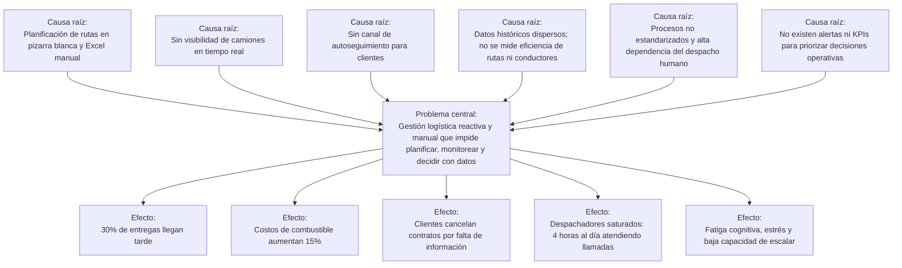
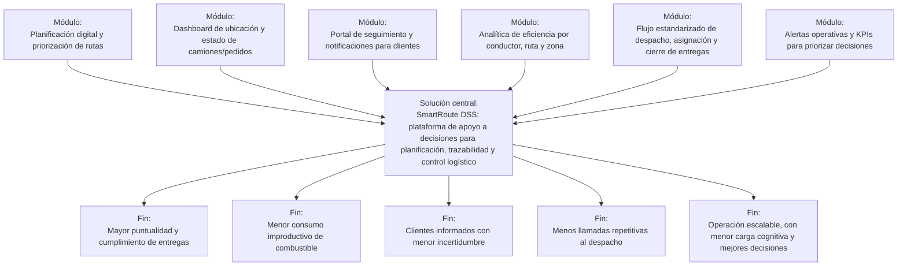

# Formulación del MVP – “De la Raíz a la Solución”

**Caso:** FlashLogistics – El Caos de la Distribución  
**Producto propuesto:** SmartRoute DSS  
**Squad:** Cacatúas
**Integrantes:** Alex Saul Fernández Valdez; Wilber Perez Subelza
**Repositorio GitHub:** https://github.com/wilylobo1244/ACTIVIDAD-2-SDI2/blob/main/README.md
**Fecha:** 10 de junio de 2026

---

## 1. Resumen ejecutivo

FlashLogistics es una empresa dedicada a la distribución de productos de consumo masivo que atraviesa una crisis operativa. Actualmente, el **30% de las entregas llegan tarde**, los **costos de combustible aumentaron 15%** durante el último semestre y los clientes están cancelando contratos por falta de información oportuna sobre sus pedidos.

El diagnóstico muestra que el problema no se limita a retrasos aislados, sino a una gestión logística manual, reactiva y sin datos. La planificación de rutas se realiza en una pizarra blanca y luego se copia a hojas de Excel; el gerente de operaciones no tiene visibilidad en tiempo real de los camiones; los despachadores dedican alrededor de 4 horas al día a responder llamadas de clientes; y la empresa no cuenta con indicadores para saber qué rutas o conductores presentan mayor ineficiencia.

Como respuesta, se propone **SmartRoute DSS**, un sistema de apoyo a la toma de decisiones logísticas que centraliza pedidos, rutas, estados, alertas y KPIs. El MVP se enfoca en resolver las causas raíz de mayor impacto: la planificación manual, los puntos ciegos operativos, la sobrecarga de consultas y la falta de datos para decidir.

---

## 2. Proceso de elicitación

El equipo abordó el caso desde una perspectiva de consultoría tecnológica, evitando proponer funcionalidades sin comprender primero el problema. Para ello se aplicaron técnicas de ingeniería de requisitos, análisis sistémico y Lean Inception acelerado.

| Técnica                        | Aplicación en FlashLogistics                                                                                     | Resultado obtenido                                                                 |
| ------------------------------ | ---------------------------------------------------------------------------------------------------------------- | ---------------------------------------------------------------------------------- |
| Análisis documental            | Revisión del caso, guía de actividad y plantilla Lean Inception.                                                 | Identificación de síntomas, datos críticos, entregables y criterios de evaluación. |
| Identificación de stakeholders | Se reconocieron los actores afectados: gerente de operaciones, despachadores, conductores, clientes y dirección. | Mapa inicial de usuarios e interesados del MVP.                                    |
| Análisis de causa raíz         | Se separaron síntomas visibles de causas profundas.                                                              | Base para construir el Árbol de Problemas.                                         |
| Árbol de Problemas             | Se ubicaron causas raíz, problema central y efectos negativos.                                                   | Visión sistémica de la crisis operativa.                                           |
| Árbol de Soluciones            | Se transformaron las causas en estados positivos y módulos de software.                                          | Base conceptual de SmartRoute DSS.                                                 |
| Lean Inception acelerado       | Se definieron visión, alcance, personas, journeys, funcionalidades y Canvas MVP.                                 | Alcance mínimo viable alineado a negocio, usuarios y factibilidad técnica.         |
| Product Backlog inicial        | Se tradujo el Canvas MVP en historias de usuario priorizadas.                                                    | Entrada para GitHub Projects y gestión ágil del proyecto.                          |

---

## 3. Análisis sistémico

### 3.1 Árbol de Problemas

**Problema central:** gestión logística reactiva y manual que impide planificar, monitorear y decidir con datos.

| Causa raíz                             | Evidencia del caso                                             | Impacto operativo                                       |
| -------------------------------------- | -------------------------------------------------------------- | ------------------------------------------------------- |
| Planificación manual de rutas          | Uso de pizarra blanca y hojas Excel copiadas manualmente.      | Errores, lentitud y baja capacidad de reacción.         |
| Falta de visibilidad en tiempo real    | El gerente no sabe dónde están los camiones.                   | Decisiones tardías ante desvíos o retrasos.             |
| Consultas de clientes sin autoservicio | Despachadores atienden 4 horas diarias llamadas de estado.     | Sobrecarga del equipo y mala experiencia del cliente.   |
| Ausencia de datos e indicadores        | No se conoce eficiencia de conductores ni rutas problemáticas. | No se puede mejorar ni escalar con evidencia.           |
| Procesos no estandarizados             | Alta dependencia de comunicación informal y revisión manual.   | Fatiga cognitiva, estrés y variabilidad en el servicio. |

### 3.2 Árbol de Soluciones

**Solución central:** SmartRoute DSS, plataforma de apoyo a decisiones para planificación, trazabilidad y control logístico.

| Causa transformada       | Módulo del MVP                                       | Resultado esperado                                     |
| ------------------------ | ---------------------------------------------------- | ------------------------------------------------------ |
| Planificación manual     | Planificador digital de rutas y asignaciones.        | Menor tiempo de planificación y mayor orden operativo. |
| Puntos ciegos            | Dashboard de ubicación y estado de pedidos/camiones. | Operación visible en tiempo real.                      |
| Sobrecarga por consultas | Portal de seguimiento y notificaciones al cliente.   | Menos llamadas repetitivas y mayor confianza.          |
| Falta de datos           | Analítica de KPIs por ruta, conductor y zona.        | Mejora continua basada en datos.                       |
| Fatiga operativa         | Alertas, estados estandarizados e incidencias.       | Menor carga cognitiva y decisiones más rápidas.        |

---

## 4. Objetivo SMART del proyecto

> Desarrollar e implementar en **12 semanas** un MVP de software tipo **DSS** para FlashLogistics que digitalice la planificación de rutas, permita visualizar el estado de camiones y pedidos, y entregue KPIs operativos, con el fin de reducir las entregas tardías del **30% al 20%**, disminuir en **50%** el tiempo diario dedicado a consultas de clientes sobre pedidos y reducir en **50%** el tiempo de planificación manual de rutas durante un piloto operativo controlado.

| Criterio SMART | Definición                                                                           |
| -------------- | ------------------------------------------------------------------------------------ |
| Específico     | DSS para planificación de rutas, trazabilidad de pedidos y KPIs logísticos.          |
| Medible        | Entregas tardías: 30% → 20%; consultas: 4h/día → 2h/día; planificación manual: -50%. |
| Alcanzable     | MVP acotado a rutas, seguimiento, alertas y dashboard; no incluye ERP completo.      |
| Relevante      | Ataca causas raíz: manualidad, puntos ciegos, sobrecarga y falta de datos.           |
| Temporal       | Piloto de 12 semanas organizado en 6 sprints de 2 semanas.                           |

---

## 5. Taller Lean Inception acelerado

### 5.1 Visión del producto

Para **FlashLogistics**, una empresa de distribución de consumo masivo que sufre retrasos, sobrecostos y pérdida de clientes por falta de visibilidad, **SmartRoute DSS** es un sistema de apoyo a la toma de decisiones logísticas que ofrece planificación digital, seguimiento de pedidos y tableros de indicadores. A diferencia de la pizarra blanca, Excel y llamadas manuales, nuestro producto centraliza rutas, estados, alertas y KPIs para que operaciones pueda decidir rápido, informar al cliente y escalar con datos.

### 5.2 Es / No es / Hace / No hace

| ES                                                      | NO ES                                                                    | HACE                                                          | NO HACE                                                               |
| ------------------------------------------------------- | ------------------------------------------------------------------------ | ------------------------------------------------------------- | --------------------------------------------------------------------- |
| Un DSS logístico para planificar, monitorear y decidir. | Un ERP completo, sistema contable o sistema de nómina.                   | Digitaliza rutas, pedidos, conductores, estados y alertas.    | No factura, no gestiona pagos ni contabilidad.                        |
| Un MVP web con apoyo móvil para conductores.            | Un sistema de mantenimiento mecánico de camiones.                        | Muestra ubicación/estado de entregas y reduce puntos ciegos.  | No repara vehículos ni compra combustible.                            |
| Una herramienta de control operativo y mejora continua. | Una solución final con inteligencia artificial avanzada desde el inicio. | Genera KPIs de puntualidad, eficiencia y rutas problemáticas. | No predice demanda avanzada ni optimiza toda la cadena de suministro. |

### 5.3 Personas

| Persona   | Rol y comportamiento                                                 | Necesidades / dolores                                                             | Valor del MVP                                                            |
| --------- | -------------------------------------------------------------------- | --------------------------------------------------------------------------------- | ------------------------------------------------------------------------ |
| Persona 1 | Gerente de operaciones. Coordina flota, rutas y cumplimiento diario. | Necesita saber dónde están los camiones, qué rutas fallan y qué decisiones tomar. | Dashboard ejecutivo, alertas y KPIs para decidir con datos.              |
| Persona 2 | Despachadora. Asigna rutas y responde llamadas de clientes.          | Pierde horas buscando estados y llamando a conductores.                           | Planificación digital, estados actualizados y menor volumen de llamadas. |
| Persona 3 | Conductor. Ejecuta ruta, entrega pedidos y reporta novedades.        | Necesita instrucciones claras y forma simple de reportar avance/incidencias.      | Vista móvil con ruta, pedidos y actualización de estados.                |
| Persona 4 | Cliente empresa. Espera entregas confiables e información oportuna.  | No quiere llamar varias veces para saber dónde está su pedido.                    | Portal de seguimiento y notificaciones de estado.                        |

### 5.4 User Journey actual vs. ideal

| Etapa                | Recorrido actual                                            | Recorrido ideal con SmartRoute DSS                                                |
| -------------------- | ----------------------------------------------------------- | --------------------------------------------------------------------------------- |
| Ingreso de pedidos   | Pedidos se consolidan de forma manual o dispersa.           | Pedidos se registran en el sistema con prioridad, dirección y ventana de entrega. |
| Planificación        | Despacho define rutas en pizarra y copia a Excel.           | El sistema organiza rutas, vehículos y conductores según reglas de negocio.       |
| Despacho             | Conductores reciben instrucciones manuales.                 | Conductores visualizan su ruta y pedidos desde una vista móvil.                   |
| Ejecución            | No hay ubicación ni estado en tiempo real.                  | Estados de pedido y ubicación se actualizan durante la ruta.                      |
| Consulta de clientes | Cliente llama y despacho consulta manualmente.              | Cliente consulta un enlace/portal con estado y ETA aproximado.                    |
| Control y mejora     | No hay datos consolidados para evaluar rutas o conductores. | Dashboard muestra KPIs, retrasos, incidentes y rutas problemáticas.               |

### 5.5 Lluvia de ideas y revisión de funcionalidades

| Funcionalidad                                             | Semáforo | Valor negocio/UX                          | Esfuerzo | Decisión MVP           |
| --------------------------------------------------------- | -------- | ----------------------------------------- | -------- | ---------------------- |
| Registro y carga de pedidos diarios                       | Verde    | Alto: base de toda la operación.          | Medio    | Incluir                |
| Planificador digital de rutas y asignación de conductores | Verde    | Muy alto: elimina pizarra y Excel manual. | Alto     | Incluir                |
| Dashboard operativo de rutas, estados y retrasos          | Verde    | Muy alto: reduce puntos ciegos.           | Medio    | Incluir                |
| Actualización móvil de estados por conductor              | Verde    | Alto: alimenta trazabilidad.              | Medio    | Incluir                |
| Portal de seguimiento para clientes                       | Verde    | Alto: reduce llamadas repetitivas.        | Medio    | Incluir                |
| KPIs por conductor, ruta y zona                           | Amarillo | Alto para mejora continua.                | Medio    | Incluir versión básica |
| Optimización avanzada con IA/ML                           | Rojo     | Valor futuro, alto riesgo inicial.        | Alto     | Fuera del MVP          |
| Integración contable/facturación                          | Rojo     | No ataca la raíz principal.               | Alto     | Fuera del MVP          |

---

## 6. Canvas MVP

El Canvas MVP consolida la decisión de empezar pequeño, pero con impacto en la raíz que más dolor genera: la falta de control operativo y visibilidad sobre rutas, pedidos y clientes.

| Bloque                  | Detalle                                                                                                                                                                                                     |
| ----------------------- | ----------------------------------------------------------------------------------------------------------------------------------------------------------------------------------------------------------- |
| Propuesta del MVP       | SmartRoute DSS centraliza pedidos, rutas, conductores y estados para apoyar decisiones operativas diarias, reducir retrasos y mejorar la comunicación con clientes.                                         |
| Personas atendidas      | Gerente de operaciones, despachador, conductor y cliente empresa.                                                                                                                                           |
| Viajes atendidos        | Planificación diaria de rutas; ejecución de entregas; consulta de estado por cliente; control de KPIs e incidencias.                                                                                        |
| Funcionalidades mínimas | 1) Registro de pedidos. 2) Planificador digital de rutas. 3) Asignación de conductor/vehículo. 4) Actualización móvil de estado. 5) Dashboard operativo. 6) Portal de seguimiento cliente. 7) KPIs básicos. |
| Resultado esperado      | Menos retrasos, menos llamadas repetitivas, menor carga cognitiva del despacho, clientes informados y decisiones basadas en datos.                                                                          |
| Métricas de validación  | Entregas tardías: 30% → 20%; llamadas/consultas: -50%; planificación manual: -50%; pedidos con estado actualizado: ≥90%; rutas activas visibles: 100%.                                                      |
| Hipótesis principal     | Si FlashLogistics centraliza planificación, seguimiento y KPIs, entonces reducirá retrasos y consultas manuales porque operaciones dejará de depender de pizarra, Excel y llamadas.                         |
| Costo y cronograma      | Piloto de 12 semanas en 6 sprints. Equipo sugerido: PO/analista, UX, desarrollador full-stack, QA/DevOps.                                                                                                   |

---

## 7. Product Backlog inicial

| ID    | Historia de usuario                                                                                                              | Prioridad | Criterios de aceptación                                                                               |
| ----- | -------------------------------------------------------------------------------------------------------------------------------- | --------- | ----------------------------------------------------------------------------------------------------- |
| US-01 | Como despachador, quiero registrar pedidos con cliente, dirección, prioridad y ventana horaria para planificar entregas del día. | Alta      | Permite crear, editar y listar pedidos; campos obligatorios validados; pedidos visibles en tablero.   |
| US-02 | Como gerente de operaciones, quiero visualizar todos los pedidos del día por estado para detectar retrasos y cuellos de botella. | Alta      | Dashboard muestra pendientes, en ruta, entregados, retrasados e incidencias.                          |
| US-03 | Como despachador, quiero asignar pedidos a una ruta, conductor y vehículo para reemplazar la pizarra manual.                     | Alta      | Ruta contiene pedidos ordenados, conductor, vehículo y hora estimada.                                 |
| US-04 | Como conductor, quiero ver mi ruta asignada desde el celular para ejecutar entregas con instrucciones claras.                    | Alta      | Vista móvil muestra lista de paradas, datos de cliente y acciones de estado.                          |
| US-05 | Como conductor, quiero actualizar el estado de cada pedido para que operaciones y clientes conozcan el avance.                   | Alta      | Estados disponibles: pendiente, en ruta, entregado, fallido, incidencia; registra hora y observación. |
| US-06 | Como cliente, quiero consultar el estado de mi pedido con un enlace para no llamar al despacho.                                  | Alta      | Portal muestra estado, fecha, ruta/ETA aproximada y contacto de soporte.                              |
| US-07 | Como gerente, quiero ver KPIs de puntualidad por ruta y conductor para tomar acciones de mejora.                                 | Media     | Reporte básico con % puntualidad, retrasos, entregas fallidas y ranking de rutas problemáticas.       |
| US-08 | Como despachador, quiero recibir alertas de retrasos o incidencias para priorizar la atención.                                   | Media     | El sistema marca rutas con retraso y lista incidencias abiertas.                                      |
| US-09 | Como administrador, quiero gestionar conductores y vehículos para mantener datos operativos actualizados.                        | Media     | CRUD básico de conductores y vehículos con estado activo/inactivo.                                    |
