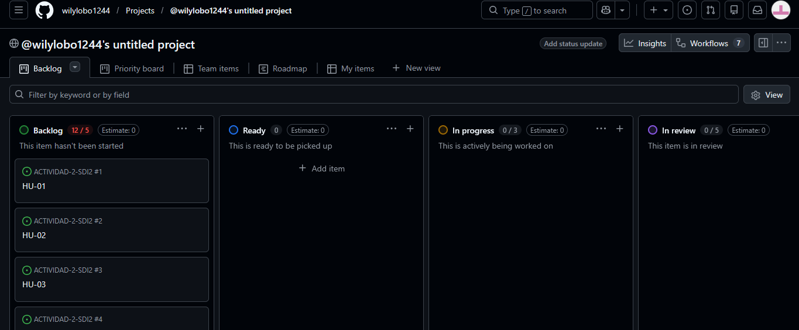
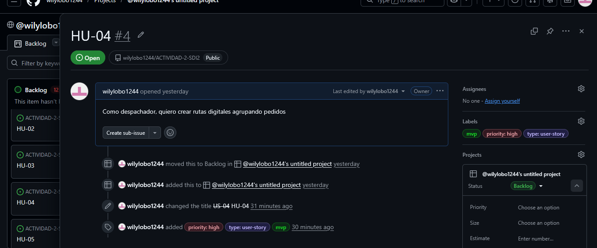

# Actividad Práctica 3: Product Backlog Building (PBB)

## "De la Visión a la Acción"

**Caso:** FlashLogistics - El Caos de la Distribución  
**Producto propuesto:** SmartRoute DSS  
**Squad:** Cacatúas  
**Integrantes del squad:** Alex Saul Fernández Valdez; Wilber Perez Subelza  
**Presentación:** Individual  
**Repositorio GitHub:** https://github.com/wilylobo1244/ACTIVIDAD-2-SDI2  
**GitHub Project / Tablero Kanban:** https://github.com/users/wilylobo1244/projects/1
**Fecha:** 11 de junio de 2026

---

## 1. Resumen del contexto

FlashLogistics presenta una crisis operativa causada por la planificación manual de rutas, la falta de visibilidad sobre camiones y pedidos, la sobrecarga de llamadas al despacho y la ausencia de indicadores para tomar decisiones. En la Actividad 2 se propuso **SmartRoute DSS**, un sistema de apoyo a la toma de decisiones logísticas enfocado en centralizar pedidos, rutas, estados, alertas y KPIs.

El objetivo de esta Actividad 3 es transformar el Canvas MVP en un **Product Backlog Building (PBB)** profesional, compuesto por épicas, historias de usuario, criterios de aceptación y elementos listos para gestionarse en GitHub Issues y GitHub Projects.

---

## 2. Enlaces solicitados

| Elemento                | Enlace                                                          |
| ----------------------- | --------------------------------------------------------------- |
| Repositorio GitHub      | https://github.com/Alex-Fernandez-2003/Actividad-2-SDI-II.git   |
| Tablero GitHub Projects | https://github.com/users/Alex-Fernandez-2003/projects/1/views/1 |

---

## 3. Identificación de épicas

| ID  | Épica                                  | Descripción                                                                                                                                                                           | Valor para el MVP                                                                      |
| --- | -------------------------------------- | ------------------------------------------------------------------------------------------------------------------------------------------------------------------------------------- | -------------------------------------------------------------------------------------- |
| E01 | Gestión de Pedidos y Recursos          | Centraliza la información base del MVP: pedidos, conductores y vehículos. Esta épica reduce la dispersión de datos y permite que la operación deje de depender de registros manuales. | Datos consistentes para planificar rutas y asignar recursos disponibles.               |
| E02 | Planificación y Asignación de Rutas    | Convierte la planificación manual de pizarra y Excel en rutas digitales con pedidos ordenados, conductor y vehículo asignados.                                                        | Menor tiempo de planificación, menor error humano y mayor control del despacho diario. |
| E03 | Seguimiento Operativo y Portal Cliente | Permite que el conductor consulte su ruta, actualice estados y que el cliente revise el avance de su pedido mediante un enlace.                                                       | Mayor trazabilidad, menos llamadas repetitivas y clientes informados.                  |
| E04 | Dashboard DSS, KPIs y Alertas          | Entrega una vista de apoyo a la toma de decisiones con estados, retrasos, incidencias y métricas operativas.                                                                          | Decisiones basadas en datos para reducir retrasos y mejorar la eficiencia logística.   |

---

## 4. Product Backlog Building

| ID   | Épica relacionada                            | Historia de Usuario (Rol + Acción + Valor)                                                                                                          | Criterios de Aceptación (mínimo 2)                                                                                                                                                                                                                                                                                   | Prioridad | Estimación |
| ---- | -------------------------------------------- | --------------------------------------------------------------------------------------------------------------------------------------------------- | -------------------------------------------------------------------------------------------------------------------------------------------------------------------------------------------------------------------------------------------------------------------------------------------------------------------- | --------- | ---------- |
| HU01 | E01 - Gestión de Pedidos y Recursos          | Como despachador, quiero registrar pedidos con cliente, dirección, prioridad y ventana horaria, para planificar correctamente las entregas del día. | 1. El sistema permite crear, editar y listar pedidos con cliente, dirección, prioridad, fecha y ventana horaria. 2. Los campos obligatorios se validan antes de guardar y se muestra un mensaje claro si falta información. 3. Cada pedido queda visible en el tablero operativo con estado inicial Pendiente. | Alta      | 5 pts      |
| HU02 | E01 - Gestión de Pedidos y Recursos          | Como administrador, quiero gestionar conductores, para mantener actualizada la información operativa del equipo de reparto.                         | 1. El sistema permite crear, editar, desactivar y listar conductores. 2. No se puede asignar una ruta a un conductor inactivo. 3. Cada conductor muestra nombre, contacto, estado y disponibilidad.                                                                                                            | Media     | 3 pts      |
| HU03 | E01 - Gestión de Pedidos y Recursos          | Como administrador, quiero gestionar vehículos, para asignar recursos disponibles a las rutas planificadas.                                         | 1. El sistema permite crear, editar, desactivar y listar vehículos. 2. No se puede asignar una ruta a un vehículo inactivo o no disponible. 3. Cada vehículo muestra placa, capacidad referencial, estado y observación operativa.                                                                             | Media     | 3 pts      |
| HU04 | E02 - Planificación y Asignación de Rutas    | Como despachador, quiero crear rutas digitales agrupando pedidos, para reemplazar la planificación manual en pizarra y Excel.                       | 1. El sistema permite crear una ruta con nombre, fecha, pedidos asociados y orden de paradas. 2. Un pedido no puede estar asignado simultáneamente a dos rutas activas. 3. La ruta muestra cantidad de pedidos, conductor, vehículo y estado general.                                                          | Alta      | 8 pts      |
| HU05 | E02 - Planificación y Asignación de Rutas    | Como despachador, quiero asignar conductor y vehículo a una ruta, para dejar preparado el despacho diario.                                          | 1. El sistema solo permite seleccionar conductores y vehículos activos. 2. Al guardar la asignación, la ruta cambia a estado Planificada. 3. El conductor asignado puede visualizar la ruta desde su vista móvil.                                                                                              | Alta      | 5 pts      |
| HU06 | E02 - Planificación y Asignación de Rutas    | Como despachador, quiero ordenar las paradas de una ruta según prioridad y ventana horaria, para reducir retrasos en entregas críticas.             | 1. El sistema permite reordenar paradas antes de iniciar la ruta. 2. Los pedidos con prioridad alta se destacan visualmente en la planificación. 3. Si una parada queda fuera de su ventana horaria, el sistema muestra una advertencia.                                                                       | Media     | 5 pts      |
| HU07 | E03 - Seguimiento Operativo y Portal Cliente | Como conductor, quiero ver mi ruta asignada desde el celular, para ejecutar las entregas con instrucciones claras.                                  | 1. La vista móvil muestra lista de paradas, cliente, dirección y observaciones del pedido. 2. El conductor solo visualiza las rutas que le fueron asignadas. 3. La pantalla debe ser usable en móvil y cargar la ruta en menos de 3 segundos en condiciones normales.                                          | Alta      | 5 pts      |
| HU08 | E03 - Seguimiento Operativo y Portal Cliente | Como conductor, quiero actualizar el estado de cada pedido, para que operaciones y clientes conozcan el avance de la entrega.                       | 1. Los estados disponibles son Pendiente, En ruta, Entregado, Fallido e Incidencia. 2. Cada cambio de estado registra fecha, hora y usuario responsable. 3. Cuando se marca Fallido o Incidencia, el sistema exige una observación.                                                                            | Alta      | 5 pts      |
| HU09 | E03 - Seguimiento Operativo y Portal Cliente | Como cliente empresa, quiero consultar el estado de mi pedido mediante un enlace, para evitar llamar repetidamente al despacho.                     | 1. El portal muestra código de pedido, estado actual, fecha de entrega y ETA aproximada cuando exista. 2. El enlace de consulta no permite modificar datos del pedido. 3. El portal muestra un contacto de soporte si el pedido está retrasado o con incidencia.                                               | Alta      | 5 pts      |
| HU10 | E04 - Dashboard DSS, KPIs y Alertas          | Como gerente de operaciones, quiero visualizar los pedidos y rutas por estado, para detectar retrasos y cuellos de botella durante el día.          | 1. El dashboard muestra pedidos Pendientes, En ruta, Entregados, Retrasados, Fallidos e Incidencias. 2. La información puede filtrarse por fecha, ruta, conductor y estado. 3. El dashboard debe actualizarse al cambiar el estado de un pedido sin recargar manualmente la página.                            | Alta      | 8 pts      |
| HU11 | E04 - Dashboard DSS, KPIs y Alertas          | Como gerente de operaciones, quiero ver KPIs de puntualidad por ruta, conductor y zona, para tomar decisiones de mejora basadas en datos.           | 1. El reporte calcula porcentaje de puntualidad, entregas retrasadas, entregas fallidas e incidencias. 2. Los KPIs pueden filtrarse por rango de fechas y conductor. 3. El sistema identifica las rutas con mayor cantidad de retrasos para priorizar acciones.                                                | Media     | 8 pts      |
| HU12 | E04 - Dashboard DSS, KPIs y Alertas          | Como despachador, quiero recibir alertas de retrasos e incidencias, para priorizar la atención operativa.                                           | 1. El sistema marca visualmente las rutas con retraso o incidencia abierta. 2. Las alertas muestran pedido, ruta, conductor, hora y motivo registrado. 3. Una alerta puede cerrarse únicamente cuando el pedido cambia a Entregado o se registra una solución.                                                 | Alta      | 5 pts      |

---

## 5. Revisión INVEST

| Criterio INVEST        | Aplicación en el backlog SmartRoute DSS                                                                                                                                |
| ---------------------- | ---------------------------------------------------------------------------------------------------------------------------------------------------------------------- |
| Independiente          | Cada HU puede desarrollarse y validarse sin depender de una entrega completa del sistema. Cuando existe dependencia lógica, se mantiene una secuencia de priorización. |
| Negociable             | Las HU describen valor de negocio, no una solución técnica cerrada; los detalles pueden refinarse en sprint planning.                                                  |
| Valorable              | Cada HU aporta valor a un actor concreto: gerente, despachador, conductor, administrador o cliente.                                                                    |
| Estimable              | Todas las HU tienen alcance claro y estimación en puntos para facilitar planificación del sprint.                                                                      |
| Small / Pequeña        | Las HU se mantuvieron pequeñas para poder implementarse dentro de un sprint o dividirse si exceden el esfuerzo esperado.                                               |
| Testable / Verificable | Cada HU tiene criterios de aceptación medibles, validables y convertibles en checklist dentro de GitHub Issues.                                                        |

---

## 6. Gestión en GitHub Projects

### 6.1 Labels por épica

| Label                           | Color sugerido | Uso                                                                      |
| ------------------------------- | -------------- | ------------------------------------------------------------------------ |
| `Epic: Pedidos y Recursos`      | `#1f77b4`      | Historias relacionadas con pedidos, conductores y vehículos.             |
| `Epic: Planificación de Rutas`  | `#2ca02c`      | Historias relacionadas con creación, ordenamiento y asignación de rutas. |
| `Epic: Seguimiento y Cliente`   | `#9467bd`      | Historias relacionadas con vista móvil, estados y portal de seguimiento. |
| `Epic: Dashboard DSS y Alertas` | `#ff7f0e`      | Historias relacionadas con dashboard, KPIs y alertas operativas.         |
| `priority: high`                | `#d73a4a`      | Historias de prioridad alta.                                             |
| `priority: medium`              | `#fbca04`      | Historias de prioridad media.                                            |
| `type: user-story`              | `#7057ff`      | Issues redactados como historias de usuario.                             |
| `mvp`                           | `#0e8a16`      | Alcance incluido dentro del MVP.                                         |

### 6.2 Columnas para el tablero Kanban

| Columna     | Descripción                                             |
| ----------- | ------------------------------------------------------- |
| Backlog     | Historias identificadas, todavía no iniciadas.          |
| Ready       | Historias refinadas con criterios de aceptación claros. |
| In Progress | Historias en desarrollo.                                |
| Review / QA | Historias en revisión o prueba.                         |
| Done        | Historias completadas y aceptadas.                      |

### 6.3 Organización por sprints

| Sprint   | Foco principal             | Historias sugeridas   |
| -------- | -------------------------- | --------------------- |
| Sprint 1 | Datos base del sistema     | HU01, HU02, HU03      |
| Sprint 2 | Planificación digital      | HU04, HU05            |
| Sprint 3 | Priorización y vista móvil | HU06, HU07            |
| Sprint 4 | Estados y portal cliente   | HU08, HU09            |
| Sprint 5 | Dashboard operativo        | HU10, HU12            |
| Sprint 6 | KPIs y cierre del piloto   | HU11, ajustes finales |

---

## 7. Evidencia visual

### 7.1 Captura del tablero Kanban

### 7.2 Captura del detalle de una Historia de Usuario

---

## 8. Reflexión técnica

Dividir el MVP en historias pequeñas ayuda a reducir el estrés del desarrollador porque transforma una visión grande y ambigua en tareas concretas, verificables y priorizadas. Al aplicar el criterio INVEST, cada historia mantiene un objetivo claro, un valor de negocio y criterios de aceptación medibles. Esto disminuye la carga cognitiva del equipo, evita discusiones innecesarias durante el sprint y permite avanzar por incrementos pequeños, validando funcionalidad antes de construir componentes más complejos del DSS.

---

## 9. Conclusión

El Product Backlog Building de SmartRoute DSS convierte el Canvas MVP en una lista accionable de trabajo técnico. Las épicas agrupan el valor principal del sistema, las historias de usuario mantienen enfoque en los roles reales de FlashLogistics y los criterios de aceptación permiten verificar la calidad de cada entrega. Con este backlog, el squad Cacatúas puede iniciar la gestión profesional del MVP en GitHub Projects y preparar el desarrollo incremental del sistema.
